# Ship Simulator

The goal is to create a realistic motor vessel simulator that will run on an online platform / in the browser.

## Table of Contents

- [Ship Simulator](#ship-simulator)
- [Stack](#stack)
- [Features](#features)
  - [Physics Simulation Core](#physics-simulation-core)
  - [3D Graphics with WebGL and Three.js](#3d-graphics-with-webgl-and-threejs)
  - [UI](#ui)
  - [Simulation Scenarios](#simulation-scenarios)
  - [Data & Extensibility](#data--extensibility)
- [Ship Simulation with Realistic Physics](#ship-simulation-with-realistic-physics)
  - [Machinery & Systems](#machinery--systems)
- [Architecture Overview](#architecture-overview)
- [Implementation Priority](#implementation-priority)
- [Getting Started](#getting-started)
  - [Prerequisites](#prerequisites)
  - [Installation](#installation)
  - [Running the Project](#running-the-project)
    - [Development Mode](#development-mode)
    - [Running with Docker](#running-with-docker)
    - [Running Tests](#running-tests)
    - [Linting and Formatting](#linting-and-formatting)
    - [Husky](#husky)
  - [Setting up AssemblyScript](#setting-up-assemblyscript)
- [Definition of Done](#definition-of-done)
- [References](#references)

## Stack

- WASM with AssemblyScript 0.27.35
- WebGL
- Three.js 0.175.0
- Next.js 15.3.0
- React
- TypeScript 5.8.3
- Tailwind CSS 4.0
- Zustand 5.0.3
- WebSockets <!-- Added for future multi-user support -->
- Socket.IO <!-- For real-time networking (future multi-user support) -->
- Express 5.1.0 <!-- Backend API/server -->
- Prisma 6.6.0 <!-- Type-safe database ORM -->
- Jest 29.7.0 <!-- Unit and integration testing -->
- Docker <!-- Containerization and deployment -->
- ESLint 9.24.0 <!-- Code linting -->
- Prettier 3.5.3 <!-- Code formatting -->
- Husky 9.1.7 <!-- Git hooks for code quality -->
- Database (PostgreSQL) <!-- For persistent backup -->
- DaisyUI <!-- UI components and design system -->

## Features

### Physics Simulation Core

- Hydrodynamics
  - Hull resistance
  - Wave interaction
  - Maneuvering forces
- Propulsion
  - Engine models
  - Propeller curves
  - Shaft dynamics
- Environmental Effects
  - Wind forces
  - Current effects
  - Sea state simulation
  - Weather effects
- Mass & Stability
  - Ballast
  - Cargo
  - Fuel consumption
  - Trim & list calculations
- Real-time Simulation
  - Continuous time-stepping
  - Event-driven simulation
  - Real-time data visualization

### 3D Graphics with WebGL and Three.js

- Vessel Model: Detailed 3D model of the ship
- Environment: Realistic ocean and weather simulation, ports
- Camera Controls: Bridge view, external view, machinery spaces

### UI

- Control panels: Telegraph, bridge controls, system monitors
- Gauges & Indicators: RPM, temperature, pressure, fuel levels, alarms
- Interactive Diagrams: System schematics, flow diagrams
- Logs & Reports: Event logs, fuel consumption, voyage data

### Simulation Scenarios

- Normal Operations
  - Start/stop engine
  - Maneuvering
  - Docking
- Failures & Emergency
  - Breakdowns
  - Fire
  - Flooding
  - Blackouts

### Data & Extensibility

- Configurable vessel data: Different ship types, engine models, cargo
- Save/Load State
- Modding

## Ship Simulation with Realistic Physics

### Machinery & Systems

- Diesel Engines
  - Four Stroke
  - Two Stroke
  - MAN B&W
  - Sulzer
- Marine Boiler
- Air Conditioning
- Compressed Air
- Batteries
- Refrigeration
- Marine Pumps
- Feed System
- Incinerator
- Refrigerants
- Gearboxes
- Governors
- Coolers
- Propellers
- Steering Gear
- Power Plants
- Turbine Gearing
- Turbochargers
- Steam turbines
- Heat Exchangers
- Fire Protection
- Fuel Treatment
- Flow Measurement
- Fuel Injection
- Fuel Oil System
- Lubricating Oil Filters
- Marine Condensers
- Oily Water Separator
- Overspeed Protection
- Piston & Piston Rings
- Crankshaft Deflection
- Sewage Treatment Plant
- Starting Air System
- Emergency Power Supply
- UMS Operations
- Dry Docking and Repairs
- Critical Machinery
- Deck Machinery
- Control Instrumentation

## Architecture Overview

Below is a flowchart that outlines the architecture of the ship simulator. It includes the main components and their interactions.

```mermaid
flowchart TD
    A(UI Layer)
    B(Simulation State)
    C(Physics Engine)
    D(3D Visualization)
    E(Scenario Manager)
    F(Data Management)

    %% UI
    A --> B

    %% State
    B --> C
    B --> D
    B --> E
    B --> F

    %% Physics Engine details
    C --> C1(Hydrodynamics)
    C1 --> C1a(Hull resistance)
    C1 --> C1b(Wave interaction)
    C1 --> C1c(Maneuvering forces)
    C1 --> C1d(Added mass & damping)
    C --> C2(Propulsion)
    C2 --> C2a(Engine model)
    C2 --> C2b(Propeller curves)
    C2 --> C2c(Shaft dynamics)
    C2 --> C2d(Transmission losses)
    C --> C3(Mass & Stability)
    C3 --> C3a(Vessel mass & CG)
    C3 --> C3b(Ballast & cargo)
    C3 --> C3c(Fuel consumption)
    C3 --> C3d(Trim & list)
    C3 --> C3e(Stability criteria)
    C --> C4(Environmental Effects)
    C4 --> C4a(Wind forces)
    C4 --> C4b(Current effects)
    C4 --> C4c(Sea state)
    C4 --> C4d(Weather)
    C --> C5(Real-time Loop)
    C5 --> C5a(Time-stepping)
    C5 --> C5b(Event system)
    C5 --> C5c(Data logging)

    %% 3D Visualization details
    D --> D1(Vessel Model)
    D --> D2(Environment & Weather)
    D --> D3(Camera Controls)
    D --> D4(System Status Visuals)

    %% Scenario Manager details
    E --> E1(Normal Operations)
    E1 --> E1a(Engine start/stop)
    E1 --> E1b(Maneuvering)
    E1 --> E1c(Ballast/cargo ops)
    E --> E2(Failures & Emergencies)
    E2 --> E2a(Machinery breakdowns)
    E2 --> E2b(Fire/flooding)
    E2 --> E2c(Blackouts)
    E2 --> E2d(Emergency procedures)
    E --> E3(Event Triggers & Logging)
    E3 --> E3a(Condition/random events)
    E3 --> E3b(Event history)
    E3 --> E3c(User actions)

    %% Data Management details
    F --> F1(Configurable vessel data)
    F --> F2(Save/load state)
    F --> F3(Database backup)
    F --> F4(Modding support)
    F --> F5(Data validation/versioning)
```



## Implementation Priority

1. **Physics Engine (Simulation Core)**
    - Hydrodynamics
        - Hull resistance (e.g., Holtrop-Mennen model)
        - Wave interaction (added resistance, motion response)
        - Maneuvering forces (rudder, propeller-rudder interaction)
        - Added mass and damping
    - Propulsion
        - Diesel engine model (torque, RPM, fuel consumption, governor)
        - Propeller curves (open water, behind hull, thrust/torque)
        - Shaft dynamics (inertia, torsional vibration, clutch)
        - Transmission losses
    - Mass & Stability
        - Vessel mass, center of gravity, moments of inertia
        - Ballast and cargo loading/unloading
        - Fuel consumption and tank levels
        - Trim and list calculations (hydrostatics)
        - Stability criteria (GM, GZ curves)
    - Environmental Effects
        - Wind forces (direction, gusts, windage area)
        - Current effects (set, drift)
        - Sea state simulation (wave spectrum, random seas)
        - Weather effects (temperature, pressure, visibility)
    - Real-time Simulation Loop
        - Fixed/variable time-stepping
        - Event system (alarms, failures, user actions)
        - Data logging and replay

2. **Simulation State Management**
    - Central state store (Zustand)
    - Vessel state (position, velocity, heading, systems)
    - Environment state (wind, waves, current, weather)
    - Engine and machinery state (RPM, temperatures, pressures)
    - Synchronization between physics, scenario manager, and UI
    - Time management (simulation time, real time, time scaling)

3. **Scenario Manager**
    - Normal Operations
        - Engine start/stop, telegraph commands, throttle/rudder control
        - Maneuvering (turning circles, stopping, docking)
        - Ballast and cargo operations
    - Failures & Emergencies
        - Machinery breakdowns (engine, pumps, generators)
        - Fire and flooding (compartment status, spread, detection)
        - Blackouts, loss of propulsion/steering
        - Emergency procedures (alarms, checklists)
    - Event Triggers and Logging
        - Condition-based and random event generation
        - Event history and reporting
        - User actions and responses

4. **Data Management**
    - Configurable vessel data (hull forms, engine models, tank layouts)
    - Save/load simulation state (snapshots, autosave)
    - Persistent backup to database (critical logs, vessel configs, user progress)
    - Modding support (custom vessels, scenarios, machinery)
    - Data validation and versioning

5. **3D Visualization**
    - Basic vessel and environment rendering (Three.js)
    - Camera controls (bridge, external, machinery spaces)
    - Dynamic ocean and weather effects
    - Visual feedback for system status and alarms

6. **User Interface**
    - Control panels (engine telegraph, bridge controls, system monitors)
    - Gauges & indicators (RPM, temperature, pressure, fuel, alarms)
    - Interactive diagrams (system schematics, flow diagrams)
    - Logs & reports (event logs, fuel consumption, voyage data)
    - Scenario selection and configuration

7. **Networking (Future)**
    - WebSocket server/client for real-time multi-user support
    - User authentication and session management
    - Synchronization of simulation state across clients

---

> Note:  
> Multi-user support and networking are not critical for the initial version. Focus on single-user simulation and local data persistence first.  
> Database integration should be designed to allow future expansion to multi-user and cloud environments.

---

## Getting Started

### Prerequisites

- [Node.js](https://nodejs.org/) (LTS recommended)
- [Docker](https://www.docker.com/) (for containerization, optional)
- [Git](https://git-scm.com/)

### Installation

1. **Clone the repository:**

   ```sh
   git clone https://github.com/your-username/ship-sim.git
   cd ship-sim
   ```

2. **Install dependencies:**

   ```sh
   npm install
   ```

3. **Set up environment variables:**
   - Copy `.env.example` to `.env` and adjust as needed for your local setup.

4. **Set up the database:**
   - If using Prisma, run:

     ```sh
     npx prisma generate
     npx prisma migrate dev --name init
     ```

### Running the Project

#### Development Mode

```sh
npm run dev
```

- Starts the Next.js development server.
- The app will be available at [http://localhost:3000](http://localhost:3000).

#### Running with Docker

```sh
docker compose up --build
```

- This will build and start all services defined in `docker-compose.yml`.

#### Running Tests

```sh
npm test
```

- Runs all Jest unit and integration tests.

#### Linting and Formatting

```sh
npm run lint      # Run ESLint
npm run format    # Run Prettier
```

#### Husky

- Git hooks are automatically set up after `npm install`.  
- Pre-commit hooks will run linting and formatting checks.

### Setting up AssemblyScript

To add AssemblyScript to your project, follow these steps (adapted from the [AssemblyScript Getting Started guide](https://www.assemblyscript.org/getting-started.html#setting-up-a-new-project)):

1. **Install AssemblyScript as a development dependency:**

   ```sh
   npm install --save-dev assemblyscript
   ```

2. **Initialize AssemblyScript project structure:**

   ```sh
   npx asinit .
   ```

   This will create the recommended directory structure and configuration files:
   - `./assembly/` — AssemblyScript source files
   - `./assembly/tsconfig.json` — TypeScript config for AssemblyScript
   - `./assembly/index.ts` — Example entry file
   - `./build/` — Compiled WebAssembly output
   - `./asconfig.json` — AssemblyScript compiler config
   - `./tests/index.js` — Starter test for the module

3. **Build the AssemblyScript module:**

   ```sh
   npm run asbuild
   ```

   This will compile your AssemblyScript code to WebAssembly and output it to the `build/` directory.

4. **Run AssemblyScript tests:**

   ```sh
   npm test
   ```

For more details, see the [AssemblyScript documentation](https://www.assemblyscript.org/introduction.html).

---

## Definition of Done

The project or a feature is considered **done** when all of the following criteria are met:

1. **Core Functionality**
    - The physics engine accurately simulates vessel movement, propulsion, and environmental effects.
    - The simulation state is managed reliably and updates propagate to all relevant components.
    - Users can interact with the simulation via the UI (control panels, gauges, diagrams).

2. **Stability & Reliability**
    - No critical bugs or crashes during normal operation.
    - All critical systems (engine, steering, ballast, etc.) are represented and interact as expected.

3. **Persistence**
    - Simulation state and user progress can be saved and loaded.
    - Critical data is backed up to the database.

4. **Testing & Quality**
    - All new code is covered by unit and integration tests (Jest).
    - Code passes linting (ESLint) and formatting (Prettier) checks.
    - All pre-commit hooks (Husky) pass.

5. **Documentation**
    - User-facing features are documented in the README or `/docs`.
    - Setup, installation, and usage instructions are up to date.

6. **Deployment**
    - The project can be run locally and via Docker without manual intervention.
    - All environment variables and configuration files are documented.

7. **Acceptance**
    - All acceptance criteria for the feature or milestone are met.
    - The feature is reviewed and approved by at least one other contributor (if applicable).

---

A feature or release is only considered **done** when it meets all the above criteria.

---

For more details, see the [documentation](./docs) folder or project wiki.

## References

[AssemblyScript Documentation][assemblyScriptDocs]
[Three.js Documentation][threeJsDocs]
[WebGL Documentation][webglDocs]
[WebGL Mozilla Documentation][webglMozillaDocs]
[Machinery Spaces][machinerySpacesLink]
[Mermaid Live][mermaidLiveLink]
[Ship resistance and propulsion - Wikipedia][shipResistanceAndPropulsionWiki]
[Skin friction and drag - Wikipedia][skinFrictionDragWiki]
[Wave-making resistance - Wikipedia][waveMakingResistanceWiki]
[Marine propulsion - Wikipedia][marinePropulsionWiki]
[Engine department - Wikipedia][engineDepartmentWiki]
[The nautical site][nauticalSiteWiki]

[assemblyScriptDocs]: https://www.assemblyscript.org/introduction.html
[threeJsDocs]: https://threejs.org/docs/
[webglDocs]: https://webglfundamentals.org/
[webglMozillaDocs]: https://developer.mozilla.org/en-US/docs/Web/API/WebGL_API
[machinerySpacesLink]: http://www.machineryspaces.com/index.html
[mermaidLiveLink]: https://mermaid.live/
[shipResistanceAndPropulsionWiki]: https://en.wikipedia.org/wiki/Ship_resistance_and_propulsion
[skinFrictionDragWiki]: https://en.wikipedia.org/wiki/Skin_friction_drag
[waveMakingResistanceWiki]: https://en.wikipedia.org/wiki/Wave-making_resistance
[marinePropulsionWiki]: https://en.wikipedia.org/wiki/Marine_propulsion
[engineDepartmentWiki]: https://en.wikipedia.org/wiki/Engine_department
[nauticalSiteWiki]: http://thenauticalsite.in/Index.html
