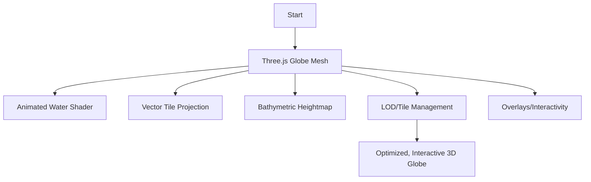
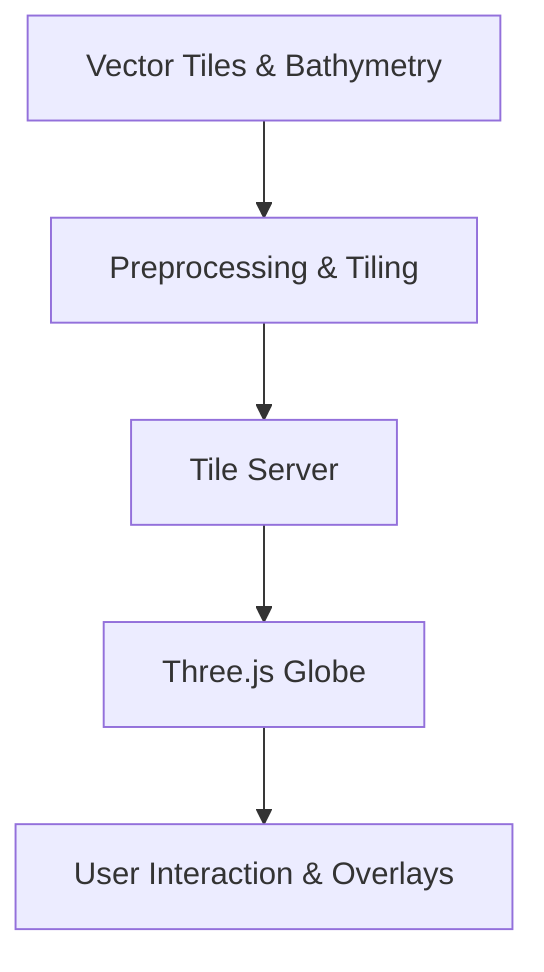

# 3D Globe with Realistic Waves and Vector Tile Projection (Three.js)

## Table of Contents

1. [Goal](#goal)
2. [Why](#why)
3. [Smallest Possible Steps](#smallest-possible-steps)
4. [Feature Details](#feature-details)
5. [Feature Highlights and User Benefits](#feature-highlights-and-user-benefits)
6. [Business Value and Stakeholder Impact](#business-value-and-stakeholder-impact)
7. [Project Risks and Open Questions](#project-risks-and-open-questions)
8. [Common Pitfalls and Support Issues](#common-pitfalls-and-support-issues)
9. [Expected Outputs](#expected-outputs)
10. [FAQ, Troubleshooting, and Best Practices](#faq-troubleshooting-and-best-practices)
11. [Quickstart](#quickstart)
12. [Status and Milestones](#status-and-milestones)
13. [Glossary](#glossary)
14. [How to Contribute](#how-to-contribute)
15. [Validation and Test Checklist](#validation-and-test-checklist)
16. [Monitoring, Logging, and Production Notes](#monitoring-logging-and-production-notes)
17. [Summary Diagram](#summary-diagram)
18. [Alt Text for Summary Diagram](#alt-text-for-summary-diagram)
19. [High-Level Architecture Diagram](#high-level-architecture-diagram)
20. [Data Privacy and Secure API Key Handling](#data-privacy-and-secure-api-key-handling)
21. [Where to Ask for Help](#where-to-ask-for-help)
22. [Step-by-Step Technical Plan for 3D Globe Implementation](#step-by-step-technical-plan-for-3d-globe-implementation)
23. [Technical Notes: LOD, Tile Management, and Blending](#technical-notes-lod-tile-management-and-blending)
24. [Data Formats and Tile Schema](#data-formats-and-tile-schema)
25. [Dependencies and Environment](#dependencies-and-environment)
26. [Acceptance Criteria](#acceptance-criteria)
27. [Reference Projects and Visuals](#reference-projects-and-visuals)
28. [Example One-Liner Tasks (Atomic Tasks)](#example-one-liner-tasks-atomic-tasks)
29. [Knowledge Areas for 3D Globe Development](#knowledge-areas-for-3d-globe-development)
30. [Atomic TODO Checklist for 3D Globe with Three.js](#atomic-todo-checklist-for-3d-globe-with-threejs)

---

## Goal

Implement a performant, visually realistic 3D globe in Three.js, featuring:

- Dynamic, animated ocean waves (Gerstner, FFT, or similar)
- Accurate projection of vector tiles for landmasses
- Real bathymetric data for underwater terrain
- Support for global navigation and maritime simulation

## Why

- Enables immersive, global-scale ship simulation with ships appearing/disappearing over the horizon
- Realistic water and terrain are essential for training, research, and visualization
- Supports overlays (routes, weather, ports) and future extensibility

## Smallest Possible Steps

1. Research Three.js globe and wave rendering techniques
2. Prototype a basic 3D globe with static land and water
3. Integrate animated wave shaders (Gerstner, FFT, or custom)
4. Develop a pipeline for projecting vector tiles onto the globe (land, bathymetry)
5. Load and blend real bathymetric data as heightmaps
6. Implement LOD and tile management for performance
7. Add overlays and interactivity (routes, ports, weather)
8. Validate, optimize, and document the workflow

## Feature Details

- [ ] 3D globe mesh with correct Earth radius and projection
- [ ] Animated water surface using advanced shaders
- [ ] Vector tile projection for landmasses (e.g., Natural Earth, OpenMapTiles)
- [ ] Bathymetric heightmap projection and blending
- [ ] LOD and tile management for globe
- [ ] Overlay support (routes, ports, weather, etc.)
- [ ] Camera controls for global navigation
- [ ] Performance profiling and optimization
- [ ] Documentation and test cases

## Feature Highlights and User Benefits

- Ships appear/disappear over the horizon
- Realistic, dynamic ocean and underwater terrain
- Accurate landmass outlines and overlays
- Extensible for future maritime features

## Business Value and Stakeholder Impact

- Supports advanced maritime training and research
- Enables visually compelling demos and educational tools
- Foundation for future features (weather, currents, global scenarios)

## Project Risks and Open Questions

- Complexity of projecting vector tiles onto a sphere
- Performance at global scale with high-res data
- Blending seams between land, water, and bathymetry
- Choice of wave simulation technique (Gerstner, FFT, custom)
- LOD and tile management for smooth navigation
- Open: Should we support polar navigation and dateline wrapping?

## Common Pitfalls and Support Issues

- Tile seams and projection artifacts
- Performance bottlenecks with high-res data
- Shader compatibility across browsers/GPUs
- Data pipeline or tile server outages

## Expected Outputs

- Three.js-based 3D globe with:
  - Animated, realistic ocean
  - Projected landmass vector tiles
  - Bathymetric heightmap terrain
  - LOD and overlays
- Documentation and test cases

## FAQ, Troubleshooting, and Best Practices

- Q: How are vector tiles projected onto the globe?
  A: By converting (lat, lon) to 3D Cartesian coordinates and mapping tile geometry accordingly.
- Q: How is bathymetry blended with water?
  A: By using heightmaps and smooth blending at coastlines.
- Best practice: Profile performance early and often; automate data pipeline.

## Quickstart

1. Set up Three.js and tile server
2. Load globe mesh and project vector tiles
3. Integrate animated water shader
4. Add bathymetric heightmap
5. Validate and optimize

## Status and Milestones

- **Last updated:** 2025-05-12
- **Current status:** Planning and prototyping
- **Next steps:**
  - [ ] Prototype globe mesh and water shader
  - [ ] Develop vector tile projection pipeline
  - [ ] Integrate bathymetric data

## Glossary

- LOD: Level of Detail
- FFT: Fast Fourier Transform (for wave simulation)
- Gerstner waves: A mathematical model for realistic ocean waves
- Heightmap: Grayscale image representing elevation
- Vector tile: Tile containing vector data (e.g., land polygons)

## How to Contribute

- Fork, branch, PR, validation checklist, support links

## Validation and Test Checklist

- [ ] Globe renders with correct scale and projection
- [ ] Water animation is smooth and realistic
- [ ] Landmass vector tiles are projected accurately
- [ ] Bathymetric data is visible and blended
- [ ] LOD/tile management works at all zoom levels
- [ ] Overlays render and interact as expected

## Monitoring, Logging, and Production Notes

- Profile GPU/CPU usage
- Monitor tile server and data pipeline
- Log shader errors and performance metrics

## Summary Diagram



## Alt Text for Summary Diagram

- Diagram shows the workflow: Start → Globe Mesh → Water, Land, Bathymetry, LOD, Overlays → End

## High-Level Architecture Diagram



## Data Privacy and Secure API Key Handling

- No user data is processed; if using external APIs, store keys securely

## Where to Ask for Help

- Open an issue in the repository or join the project discussion forum (link TBD)

---

## Step-by-Step Technical Plan for 3D Globe Implementation

1. **Choose Rendering Approach**
   - Use Three.js for globe mesh, water, and terrain rendering.

2. **Data Preparation**
   - Ensure DEM and imagery are in a projection suitable for globes (e.g., equirectangular/geodetic).
   - Prepare raster tiles or heightmaps for bathymetry and landmass data.
   - Prepare vector tiles for landmass outlines and overlays.

3. **Tiling and LOD**
   - Implement or use a quadtree LOD system for spherical tiles.
   - Dynamically load/unload tiles as the camera moves around the globe.
   - Handle poles and dateline seams.

4. **Client Integration and Rendering**
   - Map (lat, lon) to 3D Cartesian coordinates on a sphere.
   - For each visible tile:
     - Fetch raster/vector tile from the server.
     - For raster tiles: decode PNG to heightmap, generate mesh, and displace vertices.
     - For vector tiles: project polygons/lines onto the sphere.
   - Blend bathymetric and land elevation data at coastlines for seamless terrain.
   - Overlay additional data (routes, ports, weather) as vector features.

5. **Animated Water Surface**
   - Integrate advanced water shaders (Gerstner, FFT, or custom) for dynamic ocean animation.
   - Blend water and bathymetry at coastlines.
   - Profile and optimize shader performance.

6. **Camera and Navigation Controls**
   - Implement camera controls for global navigation (orbit, zoom, pan).
   - Support smooth transitions and horizon culling.

7. **Performance Optimization**
   - Use lower LOD for distant terrain, load high-res tiles only near the camera.
   - Implement tile caching and efficient memory management.
   - Profile GPU/CPU usage and optimize as needed.

8. **Testing and Validation**
   - Validate that ships appear/disappear over the horizon as expected.
   - Check for seams, pole artifacts, and dateline handling.
   - Test visual accuracy and realism in various regions and zoom levels.

9. **Documentation and Maintenance**
   - Document the globe-specific pipeline, data formats, and integration steps.
   - Update the validation checklist and troubleshooting sections.

---

## Technical Notes: LOD, Tile Management, and Blending

- **LOD/Tile Management:**
  - Use a quadtree or similar structure to manage tile loading/unloading based on camera position and zoom.
  - Unload meshes for tiles that are no longer visible.
  - For seamless LOD, load higher-resolution tiles as the camera zooms in.

- **Mesh Generation:**
  - For each tile, create a PlaneGeometry or custom sphere patch and displace vertices according to the heightmap.
  - Position the mesh in world coordinates based on tile indices (z/x/y) and spherical projection.

- **Vector Tile Projection:**
  - Convert vector tile geometries (polygons, lines) from (lat, lon) to 3D Cartesian coordinates on the sphere.
  - Render as THREE.Line, THREE.Mesh, or custom geometry.

- **Blending at Seams:**
  - Use buffer zones and weighted averaging to blend bathymetry and land at coastlines.
  - Feather edges to avoid visible steps or artifacts.

- **Overlays:**
  - Project overlays (routes, ports, weather) onto the globe using the same (lat, lon) to 3D conversion.

- **Performance:**
  - Profile rendering and network usage.
  - Optimize mesh resolution, LOD switching, and tile caching.

---

## Data Formats and Tile Schema

- Raster tiles: PNG, 256x256, equirectangular projection, EPSG:4326
- Vector tiles: MVT (Mapbox Vector Tile), WGS84 coordinates
- Heightmaps: 8-bit or 16-bit grayscale PNG, 256x256
- All coordinates and projections should be clearly documented in the data pipeline

## Dependencies and Environment

- Node.js >= 18.x
- npm packages: three, @react-three/fiber, @react-three/drei, (add others as needed)
- System: Linux (tested), GDAL for preprocessing, Python 3.x for scripts
- Tile server: TileServer GL (Docker)

## Acceptance Criteria

- [ ] Globe renders with no visible seams at all LODs
- [ ] Water animation runs at 60 FPS on target hardware
- [ ] Landmass vector tiles are projected and visible at all zoom levels
- [ ] Bathymetric data is blended and visible under water
- [ ] Overlays (routes, ports) are interactive and accurate
- [ ] All scripts and documentation are up to date

## Reference Projects and Visuals

- [three.js globe example](https://threejs.org/examples/?q=globe#webgl_geometry_earth)
- [three.js ocean shader example](https://threejs.org/examples/?q=ocean#webgl_shaders_ocean)
- [OpenMapTiles vector tile schema](https://openmaptiles.org/schema/)

## Example One-Liner Tasks (Atomic Tasks)

- Install three.js via npm
- Create a Three.js scene
- Add a sphere mesh to the scene
- Load a PNG tile from the tile server
- Convert (lat, lon) to 3D Cartesian coordinates
- Project a vector polygon onto the sphere
- Write a GLSL shader for Gerstner waves
- Blend two heightmaps at the coastline
- Implement camera orbit controls
- Fetch a vector tile from the server
- Parse MVT data in JavaScript
- Render a route overlay as a line
- Profile FPS in the browser
- Write a test for tile loading
- Document the tile schema in README

## Knowledge Areas for 3D Globe Development

- Three.js basics (scene, camera, mesh, material)
- JavaScript/TypeScript fundamentals
- WebGL and GLSL shader programming (for custom water/waves)
- Geographic coordinate systems and projections (WGS84, equirectangular)
- Tile server concepts (raster/vector tiles, LOD)
- Data preprocessing (GDAL, Python scripting)
- Performance profiling (FPS, memory, network)
- Debugging browser graphics and shader errors
- (Optional) React and @react-three/fiber if using React for UI

---

## Atomic TODO Checklist for 3D Globe with Three.js

### Setup & Environment

- [x] Install Node.js (if not already installed)
- [x] Run `npm init -y` in your project folder
- [x] Create a new Next.js page for the globe demo

### Three.js Scene Basics

- [x] Import Canvas: `import { Canvas } from 'react-three-fiber';`
- [x] Import OrbitControls: `import { OrbitControls } from '@react-three/drei';`
- [x] Set up lighting (ambient, directional)

### Add a Globe

- [x] Create sphere geometry
- [ ] Set radius to 6371 km (Earth radius)
- [x] Add a material (MeshBasicMaterial or MeshStandardMaterial)
- [x] Create a mesh with the geometry and material
- [x] Add the mesh to the scene

### Animation Loop

- [x] Write a render loop with `useFrame` or `requestAnimationFrame`
- [x] Rotate the globe mesh for a spinning effect

### Add a Texture to the Globe (React Three Fiber & drei)

- [x] Download a world map texture (equirectangular projection, PNG/JPG) and place it in `public/textures/` (done)
- [x] Import `useTexture` from `@react-three/drei`
- [x] In your Globe component, use `const texture = useTexture('/textures/Equirectangular-projection.jpg')`
- [x] Replace `<meshStandardMaterial color={0x2266cc} />` with `<meshStandardMaterial map={texture} />`
- [x] Save and reload the page to see the textured globe

#### Example Globe Component (with texture)

```tsx
import { useTexture } from '@react-three/drei';

function Globe() {
  const texture = useTexture('/textures/Equirectangular-projection.jpg');
  return (
    <mesh>
      <sphereGeometry args={[1, 64, 64]} />
      <meshStandardMaterial map={texture} />
    </mesh>
  );
}
```

### Convert (lat, lon) to 3D Globe Coordinates

- [x] Write a function:

  ```js
  function latLonToXYZ(lat, lon, radius) {
    const phi = (90 - lat) * (Math.PI / 180);
    const theta = (lon + 180) * (Math.PI / 180);
    const x = -radius * Math.sin(phi) * Math.cos(theta);
    const y = radius * Math.cos(phi);
    const z = radius * Math.sin(phi) * Math.sin(theta);
    return { x, y, z };
  }
  ```

- [x] Test the function with (0, 0) and check the result

### Add a Marker at a Specific Location

- [x] Use `latLonToXYZ` to get coordinates for a city (e.g., Helsinki)
- [x] Create a small sphere or cube at that position
- [x] Add the marker mesh to the scene

### Add Bathymetric Heightmap

- [x] **Find and Download a Grayscale Bathymetry Heightmap**
  - [x] Use [GEBCO](https://www.gebco.net/) or [SRTM30 Plus](https://topex.ucsd.edu/WWW_html/srtm30_plus.html) for global bathymetry.
  - [x] Download as GeoTIFF or PNG (preferably equirectangular projection, 8-bit or 16-bit grayscale).

- [x] **Preprocess Heightmap for Web Use**
  - [x] Use GDAL to reproject and resize to 4096x2048 or 2048x1024 (equirectangular, EPSG:4326).
  - [x] Normalize values: ocean depths as negative, land as positive or zero.
  - [x] Export as PNG for easy loading in Three.js.

- [x] **Serve Heightmap via TileServer**
  - [x] Place the PNG in the tileserver’s data directory (see docker-compose.yml).
  - [x] Optionally, tile the heightmap for LOD (using gdal2tiles or similar).

- [x] **Load Heightmap Texture in Three.js**
  - [x] Use useTexture or THREE.TextureLoader to load the PNG in your Globe component.

- [ ] **Displace Globe Mesh in Vertex Shader**
  - [ ] Pass the heightmap as a uniform to a custom ShaderMaterial.
  - [ ] In the vertex shader, sample the heightmap using UV coordinates.
  - [ ] Displace the sphere’s vertices outward/inward based on sampled value.

- [ ] **Blend Color Between Land and Water**
  - [ ] In the fragment shader, use the sampled height to blend between water and land colors.
  - [ ] Optionally, use a colormap for more realistic bathymetry.

- [ ] **Test and Validate**
  - [ ] Check for visible seams or artifacts.
  - [ ] Validate that underwater terrain and landmasses are visually correct.

- [ ] **Document Data Source and Processing**
  - [ ] Note the source, projection, and processing steps in the docs for reproducibility.

### LOD and Tile Management

- [ ] Write a function to determine which tiles are visible based on camera position
- [ ] Load higher-res tiles as you zoom in
- [ ] Unload tiles that are out of view

### Overlay a Route

- [ ] Define a route as an array of (lat, lon) points
- [ ] Convert each point to 3D with `latLonToXYZ`
- [ ] Create a `THREE.Line` from the points
- [ ] Add the line to the scene

### Profile Performance

- [ ] Open browser dev tools
- [ ] Check FPS in the performance tab
- [ ] Log memory usage

### Write Documentation

- [ ] Write a README section explaining how to run the globe demo
- [ ] Document the tile schema and coordinate conversion

## Current Issues

- [x] Camera is clipping when globe radius is over 1000 and camera zoom is further than 1000. -> Solution was to update the camera far plane.

---
*Use this file to guide the implementation of a 3D globe with realistic waves and vector tile projection in Three.js. Update as the project evolves.*
