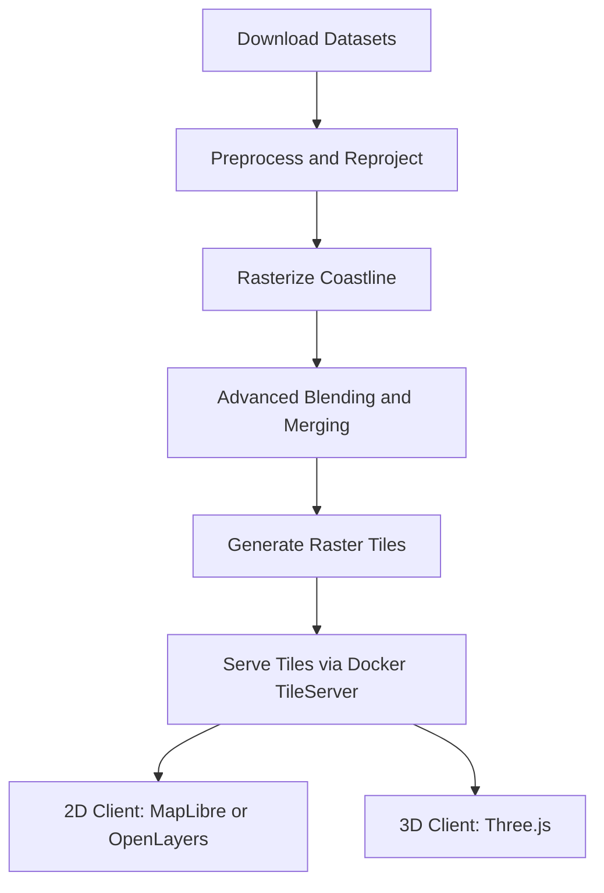

# Importing and Using Multi-Resolution Coastline and Bathymetric Data

## Table of Contents

1. [Goal](#goal)
2. [Why](#why)
3. [Feature Details](#feature-details)
4. [Alternative Path: Using External APIs and Public Tile Servers](#alternative-path-using-external-apis-and-public-tile-servers)
5. [3D Graphics and Heightmaps Integration](#3d-graphics-and-heightmaps-integration)
6. [Data Source Comparison: Pros and Cons](#data-source-comparison-pros-and-cons)
7. [Merging Data Sources: Step-by-Step Workflow](#merging-data-sources-step-by-step-workflow)
8. [Automated DEM Merging and Tiling Workflow](#automated-dem-merging-and-tiling-workflow)
9. [Advanced Blending Script (Python)](#advanced-blending-script-python)
10. [Automated Data Download and Update Script (Bash)](#automated-data-download-and-update-script-bash)
11. [Running a Tile Server in Docker](#running-a-tile-server-in-docker)
12. [Client Integration: 2D and 3D (Detailed)](#client-integration-2d-and-3d-detailed)
13. [FAQ, Troubleshooting, and Best Practices](#faq-troubleshooting-and-best-practices)
14. [Quickstart](#quickstart)
15. [Status and Milestones](#status-and-milestones)
16. [Glossary](#glossary)
17. [How to Contribute](#how-to-contribute)
18. [Validation and Test Checklist](#validation-and-test-checklist)
19. [Monitoring, Logging, and Production Notes](#monitoring-logging-and-production-notes)
20. [Summary Diagram](#summary-diagram)

---

## Goal

Integrate global coastline and bathymetric data into the ship simulator, supporting multiple levels of detail (LOD) for efficient rendering and network performance. The system should allow dynamic loading of data based on the user's viewport and zoom level, similar to industry standards in GIS and game development.

## Why

- Large GeoJSON files (e.g., 18MB for 1:10m coastlines) are too big for real-time or networked applications.
- Efficient rendering and data transfer are critical for ECDIS and navigation systems.
- Multi-resolution data enables smooth zooming and panning, with appropriate detail at each scale.

## Feature Details

### Research and Select Data Formats

- Identify available coastline and bathymetric datasets (e.g., Natural Earth, GEBCO).
- Research vector tile formats (.mvt, .pbf) and their specifications.
- Compare preprocessing tools: Tippecanoe, mapshaper, GDAL, and document their pros/cons.
- Decide on the optimal data format and preprocessing toolchain.

### Preprocess Source Data

- Download source GeoJSON and bathymetric data.
- For each desired resolution (1:110m, 1:50m, 1:10m):
  - Simplify geometries for the target zoom level.
  - Convert simplified data to vector tiles using the chosen tool.
  - Validate the output tiles for correctness and completeness.

### Set Up Tile Server or Static Hosting

- Choose between a dynamic tile server or static file hosting.
- Install and configure the chosen tile server (e.g., TileServer GL) or set up static hosting.
- Organize generated tiles into folders by zoom level and region.
- Test tile serving locally and/or remotely.

### Client Integration

- Select a mapping library with vector tile support (e.g., MapLibre GL JS, OpenLayers).
- Integrate the mapping library into the ECDIS/chart system.
- Implement dynamic tile loading based on viewport and zoom.
- Implement automatic LOD switching as the user zooms in/out.
- Style the coastline and bathymetry layers for clarity and performance.

### Performance Optimization

- Enable gzip/deflate compression for tile delivery on the server/hosting.
- Profile rendering performance in the client (FPS, memory usage).
- Profile network usage (tile size, load times).
- Optimize tile size, geometry complexity, and rendering code as needed.

### Testing and Validation

- Test tile loading and rendering in various regions and zoom levels.
- Validate the visual accuracy of coastlines and bathymetry.
- Test performance under different network conditions.
- Gather feedback from users and stakeholders.

### Documentation and Maintenance

- Document the data pipeline: source, preprocessing, tile generation, hosting.
- Document integration steps for the client.
- Write update procedures for new data releases.
- Maintain a changelog for data and integration updates.

---

## Alternative Path: Using External APIs and Public Tile Servers

### Goal of Alternative Path

Leverage existing public APIs and tile servers to provide coastline, bathymetric, and elevation data for both 2D and 3D graphics, minimizing infrastructure and preprocessing work.

### Minimal Required Steps

1. Identify Suitable APIs/Tile Servers
   - Research available APIs (e.g., Mapbox, OpenMapTiles, GEBCO WMS, NOAA, AWS Terrain Tiles, Cesium World Terrain).
   - Evaluate data coverage, resolution, update frequency, and licensing for your use case.

2. Choose Data Formats and Protocols
   - Decide between vector tiles (e.g., .mvt, .pbf) and raster tiles (e.g., PNG, JPEG, quantized mesh).
     - Pros of vector tiles: Smaller size, style flexibility, better for 2D/3D vector rendering, but may lack detailed elevation/bathymetry.
     - Pros of raster tiles: Directly usable as heightmaps/textures, good for 3D terrain, but less flexible for styling and larger in size.
     - Quantized mesh (e.g., Cesium): Optimized for 3D terrain, efficient LOD, but requires specific client support.

3. Integrate API Access in Client
   - Update the 2D/3D client (e.g., MapLibre, Three.js) to fetch and render tiles from the chosen API.
   - Implement authentication if required (e.g., API keys for Mapbox).
   - Handle tile loading, LOD switching, and error fallback.

4. Test and Validate
   - Check data accuracy, visual quality, and performance in your application.
   - Profile network usage and rendering speed.
   - Ensure compliance with API terms of use and attribution requirements.

5. Document Integration
   - Record which APIs are used, configuration details, and any client-side code changes.
   - Note any limitations or fallback plans if APIs change or become unavailable.

---

## 3D Graphics and Heightmaps Integration

### Goal of 3D Graphics Integration

Enable the use of bathymetric and elevation data for 3D graphics in the simulator, supporting realistic underwater and land terrain visualization around water bodies.

### Smallest Required Steps

1. Research Suitable Datasets
   - Identify high-resolution bathymetric datasets (e.g., GEBCO, SRTM30_PLUS, ETOPO1) for underwater terrain.
   - Identify elevation datasets (e.g., SRTM, ASTER) for land heightmaps.
   - Evaluate data formats (GeoTIFF, DEM, raster tiles, vector tiles) for 3D use.

2. Preprocess Data for 3D Use
   - Download and clip datasets to regions of interest.
   - Convert bathymetric and elevation data into raster or vector tiles suitable for 3D rendering (e.g., quantized mesh, heightmap PNGs, or .mvt tiles).
   - Simplify and optimize data for different LODs and performance.
   - Validate tile outputs for both land and underwater regions.

3. Serve Tiles for 3D Environment
   - Configure the tile server to serve both bathymetric and elevation tiles (vector or raster).
   - Organize tiles by type (bathymetry/land), zoom level, and region.
   - Test tile delivery and access patterns for 3D clients.

4. Integrate with 3D Graphics Engine
   - Update the 3D environment code (e.g., Three.js) to request and load heightmap or mesh tiles from the server.
   - Implement terrain mesh generation from heightmap or vector tile data.
   - Blend bathymetric and land elevation data at coastlines for seamless terrain.
   - Apply appropriate textures and shaders for underwater and land surfaces.

5. Optimize and Test
   - Profile 3D rendering performance (FPS, memory, tile loading times).
   - Optimize mesh resolution, LOD switching, and tile caching.
   - Test visual accuracy and realism in various regions and zoom levels.
   - Gather feedback and iterate on data quality and rendering.

6. Document the Pipeline
   - Document the data sources, preprocessing steps, tile server configuration, and 3D integration process.
   - Provide update instructions for new data releases or regions.

---

## Data Source Comparison: Pros and Cons

### GEBCO (General Bathymetric Chart of the Oceans)

- **Pros:**
  - Truly global coverage (oceans and land)
  - Freely available, regularly updated
  - Good for general-purpose bathymetry and global-scale applications
- **Cons:**
  - Coarse resolution (typically 15 arc-seconds, ~500m)
  - May lack detail in shallow coastal areas and lakes
  - Some artifacts in land/sea transitions

### SRTM30_PLUS

- **Pros:**
  - Combines SRTM land elevation with ocean bathymetry
  - Higher land resolution (SRTM: ~30m, but SRTM30_PLUS is resampled to 30 arc-seconds, ~1km)
  - Good for seamless land/ocean transition
- **Cons:**
  - Ocean bathymetry is lower resolution than land
  - SRTM coverage is limited to latitudes 60°N–56°S (no poles)
  - May have voids or artifacts in mountainous/coastal regions

### ETOPO1/ETOPO2022

- **Pros:**
  - Global coverage, including polar regions
  - Integrates multiple sources (GEBCO, SRTM, ICESat, etc.)
  - Available as both bedrock and ice surface models
  - 1 arc-minute (~1.8km) resolution
- **Cons:**
  - Lower resolution than SRTM for land
  - May smooth out sharp features
  - Some inconsistencies at land/sea boundaries

---

## Merging Data Sources: Step-by-Step Workflow

1. **Reproject to Common Grid**
   - Use GDAL or QGIS to reproject all datasets to the same CRS (e.g., WGS84) and resolution.
     - <https://gdal.org/en/stable/programs/gdalwarp.html>

2. **Define Coverage Priority**
   - Use SRTM for land (where available, for high-res terrain).
   - Use GEBCO or ETOPO1 for ocean bathymetry and areas not covered by SRTM.

3. **Create a Seam/Blend Zone**
   - Define a coastline polygon or buffer zone for blending land and sea data.
     - We can use NaturalEarth 1:110m coastlines or similar datasets.
   - In overlap zones, blend using a weighted average or feathering to avoid sharp steps.

4. **Merge Rasters**
   - Use gdal_merge.py or QGIS raster calculator to combine rasters, prioritizing higher-resolution data.
     - <https://gdal.org/en/stable/programs/gdal_merge.html>
   - Fill voids or missing data with the next-best source.

5. **Validate and Clean Up**
   - Visually inspect the merged DEM for artifacts or discontinuities.
   - Use tools like QGIS or custom scripts to fix any issues at boundaries.

6. **Export and Tile**
   - Export the merged DEM as GeoTIFF or other suitable format.
   - Use tiling tools (e.g., gdal2tiles, Tippecanoe for vector, or custom scripts) to generate tiles for serving.
     - <https://gdal.org/en/stable/programs/gdal2tiles.html>
     - <https://github.com/felt/tippecanoe>

### Tools

- GDAL (gdalwarp, gdal_merge.py)
- QGIS raster calculator
  - <https://download.qgis.org/qgisdata/QGIS-Documentation-2.6/live/html/en/docs/user_manual/working_with_raster/raster_calculator.html>
- Custom Python scripts (e.g., rasterio, numpy)
  - <https://rasterio.readthedocs.io/en/stable/>

---

## Automated DEM Merging and Tiling Workflow

This section provides a ready-to-run workflow for merging SRTM, GEBCO/ETOPO1, and using the Natural Earth coastline as a seam, plus instructions for tiling and running a tile server in Docker.

### Prerequisites

- Linux system with `gdal`, `python3`, and `pip` installed
- Downloaded datasets:
  - SRTM (GeoTIFF)
  - GEBCO or ETOPO1 (GeoTIFF)
  - Natural Earth coastline (GeoJSON, 1:110m)

### Directory Structure Example

```plaintext
data/
  srtm.tif
  gebco.tif
  coastline.geojson
output/
```

### Bash Script: Merge and Tile DEMs

Save as `scripts/merge_and_tile.sh` and make executable (`chmod +x scripts/merge_and_tile.sh`).

```bash
#!/bin/bash
set -e
# Paths
DATADIR="data"
OUTDIR="output"
SRTM="$DATADIR/srtm.tif"
GEBCO="$DATADIR/gebco.tif"
COASTLINE="$DATADIR/coastline.geojson"
MASK="$OUTDIR/land_mask.tif"
MERGED="$OUTDIR/merged_dem.tif"
TILES="$OUTDIR/tiles"

mkdir -p "$OUTDIR"

# 1. Align rasters (reproject/resample to match SRTM)
gdalwarp -t_srs EPSG:4326 -tr 0.01 0.01 -r bilinear "$GEBCO" "$OUTDIR/gebco_resampled.tif"

# 2. Rasterize coastline to create land mask (1=land, 0=sea)
gdal_rasterize -tr 0.01 0.01 -te $(gdalinfo "$SRTM" | grep "Lower Left" | awk '{print $3,$4}' | tr -d '(),') $(gdalinfo "$SRTM" | grep "Upper Right" | awk '{print $3,$4}' | tr -d '(),') -burn 1 -ot Byte -of GTiff "$COASTLINE" "$MASK"

# 3. Merge DEMs using mask (land=SRTM, sea=GEBCO)
gdal_calc.py -A "$SRTM" -B "$OUTDIR/gebco_resampled.tif" -C "$MASK" --outfile="$MERGED" --calc="(C==1)*A + (C==0)*B" --NoDataValue=0

# 4. Generate raster tiles (for web/3D use)
gdal2tiles.py -z 0-7 "$MERGED" "$TILES"

echo "Merging and tiling complete. Tiles in $TILES"
```

---

## Advanced Blending Script (Python)

This script blends SRTM and GEBCO/ETOPO1 DEMs using a buffer zone around the coastline for smooth transitions. Save as `scripts/merge_and_blend.py`.

```python
import rasterio
import numpy as np
from rasterio.features import rasterize
from shapely.geometry import shape
import fiona
from scipy.ndimage import distance_transform_edt
from osgeo import gdal
import subprocess

# Parameters
BUFFER_SIZE = 10  # pixels (adjust for wider/narrower blending zone)

# Paths
srtm = 'data/srtm.tif'
gebco = 'data/gebco.tif'
coastline = 'data/coastline.geojson'
merged = 'output/merged_dem.tif'

# 1. Open SRTM as reference
with rasterio.open(srtm) as ref:
    profile = ref.profile
    shape_ref = ref.shape
    transform = ref.transform

# 2. Reproject GEBCO to match SRTM
gdal.Warp('output/gebco_resampled.tif', gebco, format='GTiff', xRes=profile['transform'][0], yRes=-profile['transform'][4], dstSRS=profile['crs'])

# 3. Rasterize coastline
with fiona.open(coastline) as src:
    geoms = [shape(f['geometry']) for f in src]
mask = rasterize(
    [(geom, 1) for geom in geoms],
    out_shape=shape_ref,
    transform=transform,
    fill=0,
    dtype='uint8'
)

# 4. Compute distance to coastline (buffer zone)
dist_land = distance_transform_edt(mask == 1)
dist_sea = distance_transform_edt(mask == 0)
blend_zone = (dist_land <= BUFFER_SIZE) & (dist_sea <= BUFFER_SIZE)
blend_weight = dist_sea[blend_zone] / (dist_land[blend_zone] + dist_sea[blend_zone])

# 5. Merge and blend DEMs
with rasterio.open(srtm) as src_a, rasterio.open('output/gebco_resampled.tif') as src_b:
    a = src_a.read(1)
    b = src_b.read(1)
    merged_dem = np.where(mask == 1, a, b)
    # Blend in buffer zone
    merged_dem_blend = merged_dem.copy()
    merged_dem_blend[blend_zone] = (
        a[blend_zone] * (1 - blend_weight) + b[blend_zone] * blend_weight
    )
    with rasterio.open(merged, 'w', **profile) as dst:
        dst.write(merged_dem_blend, 1)

# 6. Generate tiles
subprocess.run(['gdal2tiles.py', '-z', '0-7', merged, 'output/tiles'])
print('Advanced blending and tiling complete.')
```

---

## Automated Data Download and Update Script (Bash)

This script downloads the latest SRTM, GEBCO, and Natural Earth coastline data, checks for updates, and triggers the merge/blend pipeline. Save as `scripts/download_and_update.sh` and make executable.

```bash
#!/bin/bash
set -e
DATADIR="data"
OUTDIR="output"

mkdir -p "$DATADIR" "$OUTDIR"

# Download SRTM (example: SRTM global 1 arc-second, modify as needed)
wget -N -O "$DATADIR/srtm.tif" "https://example.com/srtm.tif"

# Download GEBCO (example: GEBCO 2023)
wget -N -O "$DATADIR/gebco.tif" "https://www.bodc.ac.uk/data/open_download/gebco/gebco_2023/geotiff/GEBCO_2023.tif"

# Download Natural Earth coastline (1:110m)
wget -N -O "$DATADIR/coastline.geojson" "https://www.naturalearthdata.com/http//www.naturalearthdata.com/download/110m/physical/ne_110m_coastline.geojson.zip"

# Unzip coastline if needed
if [[ "$DATADIR/coastline.geojson" == *.zip ]]; then
  unzip -o "$DATADIR/coastline.geojson" -d "$DATADIR"
fi

# Run advanced blending script
python3 scripts/merge_and_blend.py
```

---

## Running a Tile Server in Docker

A simple and popular choice is [TileServer GL](https://github.com/maptiler/tileserver-gl) for vector/raster tiles. Here’s a minimal setup:

### Docker Compose File (docker-compose.yml)

```yaml
version: '3'
services:
  tileserver:
    image: maptiler/tileserver-gl
    ports:
      - "8080:80"
    volumes:
      - ./output/tiles:/data
    environment:
      - TILESERVER_CONFIG=/data/config.json
```

### Start the Server

```bash
docker-compose up -d
echo "TileServer running at http://localhost:8080"
```

### Access Tiles

- Raster tiles: `http://localhost:8080/data/{z}/{x}/{y}.png`
- Vector tiles (if generated): `http://localhost:8080/data/{z}/{x}/{y}.pbf`

---

## Client Integration: 2D and 3D (Detailed)

### 2D Client (MapLibre GL JS / OpenLayers)

1. Ensure your tile server is running and accessible (e.g., <http://localhost:8080/data/{z}/{x}/{y}.png>).
2. In your client code, add a raster tile layer:
   - **MapLibre GL JS**:

     ```js
     map.addSource('bathymetry', {
       type: 'raster',
       tiles: ['http://localhost:8080/data/{z}/{x}/{y}.png'],
       tileSize: 256
     });
     map.addLayer({
       id: 'bathymetry',
       type: 'raster',
       source: 'bathymetry',
       paint: {}
     });
     ```

   - **OpenLayers**:

     ```js
     import TileLayer from 'ol/layer/Tile';
     import XYZ from 'ol/source/XYZ';
     const bathymetryLayer = new TileLayer({
       source: new XYZ({
         url: 'http://localhost:8080/data/{z}/{x}/{y}.png',
       }),
     });
     map.addLayer(bathymetryLayer);
     ```

### 3D Client (Three.js)

1. Use a tile loader (e.g., [three.js examples/terrain](https://threejs.org/examples/?q=terrain#webgl_geometry_terrain)) or custom code to fetch and apply raster tiles as heightmaps.
2. For each visible tile:
   - Fetch the PNG tile from the server.
   - Decode the PNG to a heightmap array (use a canvas or image loader).
   - Generate a PlaneGeometry mesh and displace vertices according to the heightmap.
   - Position the mesh in world coordinates based on tile indices (z/x/y).
3. For seamless LOD, load higher-resolution tiles as the camera zooms in.
4. Optionally, overlay vector coastline data for visual clarity.

#### Example (Three.js, pseudo-code)

```js
const loader = new THREE.TextureLoader();
loader.load('http://localhost:8080/data/5/17/10.png', texture => {
  // Convert texture to height data, then apply to geometry
  // ...
});
```

---

## FAQ, Troubleshooting, and Best Practices

### Data Licensing and Attribution

- Always review and comply with the licensing terms of SRTM, GEBCO, ETOPO1, and Natural Earth datasets.
- When using external APIs or third-party tiles, provide attribution as required by the provider.

### Coordinate Systems and Projections

- Ensure all datasets are reprojected to a common CRS (typically WGS84/EPSG:4326) before merging or tiling.
- Be aware of projection distortions, especially at high latitudes.

### Performance and Security

- For production, consider using a CDN or caching proxy in front of your tile server.
- Secure your Docker containers and restrict access to the tile server as needed.
- Monitor tile server performance and disk usage.

### Troubleshooting

- If tiles do not align, check CRS, resolution, and tile origin.
- If the tile server fails to start, check Docker logs and file permissions.
- For rendering artifacts at seams, adjust the buffer size in the blending script or inspect the coastline mask.

### Best Practices

- Document your data pipeline and update schedule.
- Automate data downloads and processing where possible.
- Regularly validate the visual output in both 2D and 3D clients.
- Keep this documentation up to date as your workflow evolves.

---

## Quickstart

Follow these steps to get up and running quickly:

1. Clone the repository and install dependencies.
2. Download and prepare the required datasets (SRTM, GEBCO, Natural Earth coastline).
3. Run the automated data download and blending script:

   ```bash
   bash scripts/download_and_update.sh
   ```

4. Start the tile server in Docker:

   ```bash
   docker-compose up -d
   ```

5. Integrate the tiles into your 2D or 3D client as described below.

---

## Status and Milestones

- **Last updated:** May 8, 2025
- **Current status:** End-to-end workflow implemented, advanced blending and automation in place, client integration documented.
- **Next steps:**
  - Add summary diagram/flowchart
  - Pin dependency versions in scripts
  - Expand test/validation checklist
  - Add glossary and contribution guidelines

---

## Glossary

- **DEM:** Digital Elevation Model
- **LOD:** Level of Detail
- **CRS:** Coordinate Reference System
- **GDAL:** Geospatial Data Abstraction Library
- **GeoTIFF:** A georeferenced raster image format
- **PNG:** Portable Network Graphics (raster image format)
- **Vector tile:** A tile containing vector data (e.g., .mvt, .pbf)
- **Raster tile:** A tile containing raster image data (e.g., .png, .jpg)

---

## How to Contribute

- Fork the repository and create a feature branch.
- Make your changes and ensure all scripts and documentation are updated.
- Run the validation checklist below before submitting a pull request.
- For questions or help, open an issue or join the project discussion forum (link TBD).

---

## Validation and Test Checklist

- [ ] All scripts run without errors on a clean Linux environment.
- [ ] Tiles are generated and served correctly at all zoom levels.
- [ ] Coastline blending is visually smooth at land/sea boundaries.
- [ ] 2D and 3D clients load and render tiles as expected.
- [ ] Data sources are up to date and attribution is provided.
- [ ] Docker tile server starts and serves tiles at <http://localhost:8080>.
- [ ] Documentation is up to date and clear for new contributors.

---

## Monitoring, Logging, and Production Notes

- Use Docker logs to monitor the tile server:

  ```bash
  docker-compose logs -f tileserver
  ```

- For production, consider using a CDN or caching proxy in front of the tile server.
- Monitor disk usage in the output/tiles directory and set up alerts if needed.
- Pin versions of Python, GDAL, and other dependencies in your scripts for reproducibility.

---

## Summary Diagram



---

This workflow enables high-performance, multi-resolution 3D terrain rendering in Three.js using your own DEM tiles, with smooth blending at coastlines and easy Docker-based serving.

---
