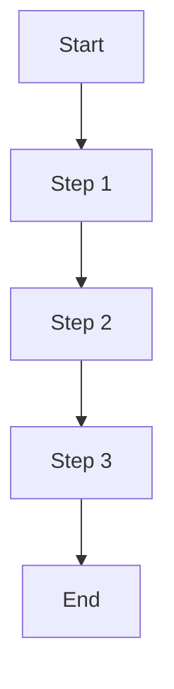

# [Feature Name] Specification Template

# Table of Contents
1. [Goal](#goal)
2. [Why](#why)
3. [Smallest Possible Steps](#smallest-possible-steps)
4. [Feature Details](#feature-details)
5. [FAQ, Troubleshooting, and Best Practices](#faq-troubleshooting-and-best-practices)
6. [Quickstart](#quickstart)
7. [Status and Milestones](#status-and-milestones)
8. [Glossary](#glossary)
9. [How to Contribute](#how-to-contribute)
10. [Validation and Test Checklist](#validation-and-test-checklist)
11. [Monitoring, Logging, and Production Notes](#monitoring-logging-and-production-notes)
12. [Summary Diagram](#summary-diagram)

---

# Goal
Describe the main objective of this feature. What problem does it solve? What is the intended outcome?

# Why
Explain why this feature is important for the project. List the benefits, use cases, or requirements it addresses.

# Smallest Possible Steps
1. Research and select data sources, formats, or protocols as needed.
2. Break down the feature into actionable tasks (UI, backend, integration, etc.).
3. Implement and test each sub-feature or component.
4. Validate integration with the rest of the system.
5. Document the process and update as needed.

# Feature Details
- [ ] List core requirements or sub-features here.
- [ ] Add implementation notes, design decisions, or technical constraints.
- [ ] Reference related files, APIs, or components.

# FAQ, Troubleshooting, and Best Practices
- Add common questions and answers about this feature.
- List troubleshooting tips for common issues.
- Share best practices for development, testing, and deployment.

# Quickstart
1. Prerequisites (dependencies, environment setup, etc.)
2. Step-by-step instructions to get started with this feature.
3. Example commands or code snippets.

# Status and Milestones
- **Last updated:** [YYYY-MM-DD]
- **Current status:** [e.g., In progress, Complete, Needs review]
- **Next steps:**
  - [ ] List upcoming tasks or milestones

# Glossary
- Define technical terms, acronyms, or domain-specific language used in this feature.

# How to Contribute
- Steps for contributing to this feature (branching, PRs, code review, etc.)
- Where to ask for help or discuss changes.

# Validation and Test Checklist
- [ ] List all validation steps and test cases for this feature.
- [ ] Ensure all requirements are met and tested.

# Monitoring, Logging, and Production Notes
- Add notes on monitoring, logging, or production deployment if applicable.

# Summary Diagram

---

*Use this template for new features. Update and expand sections as needed for your specific use case.*
