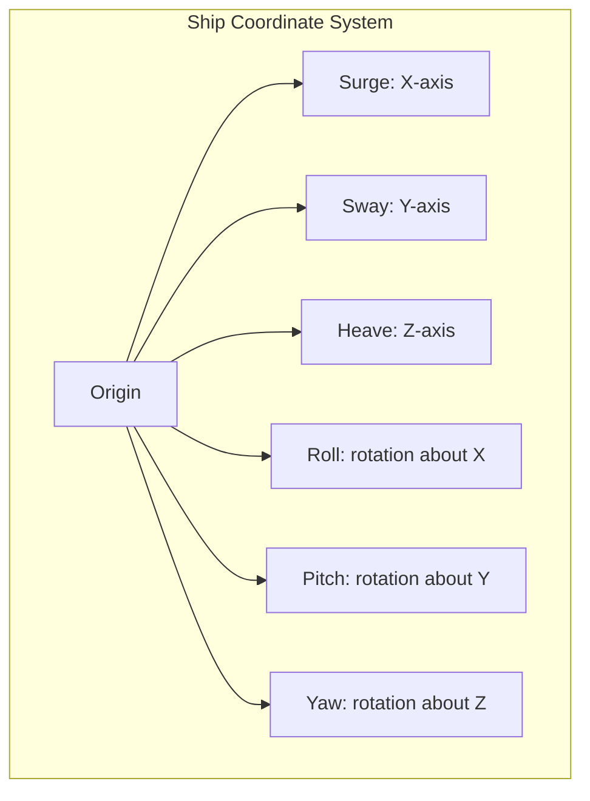
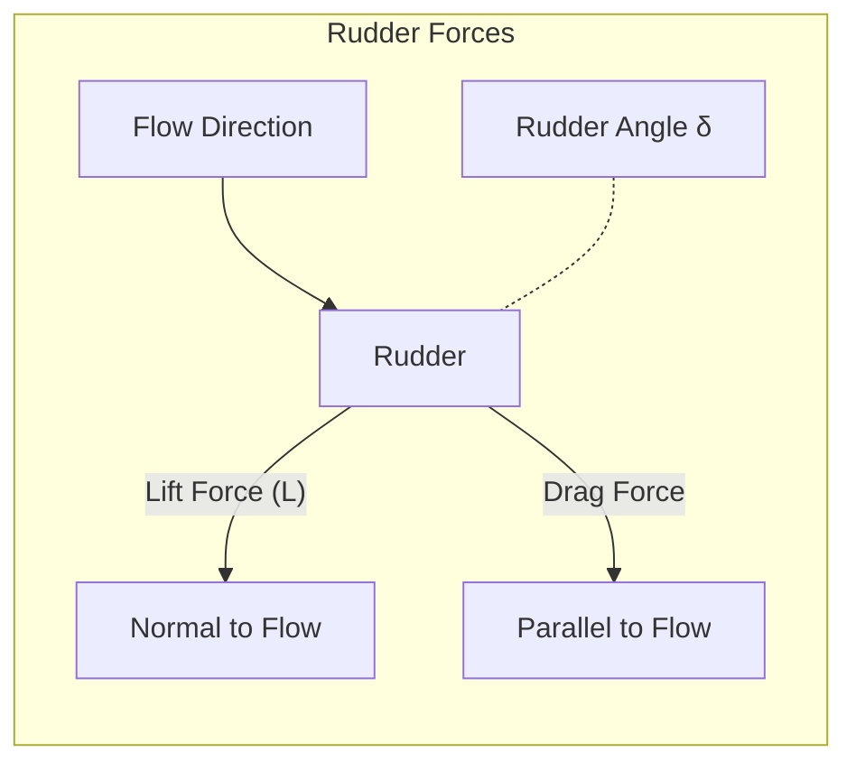
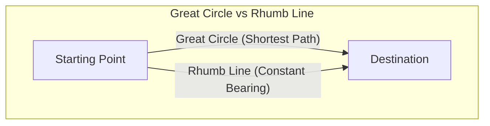
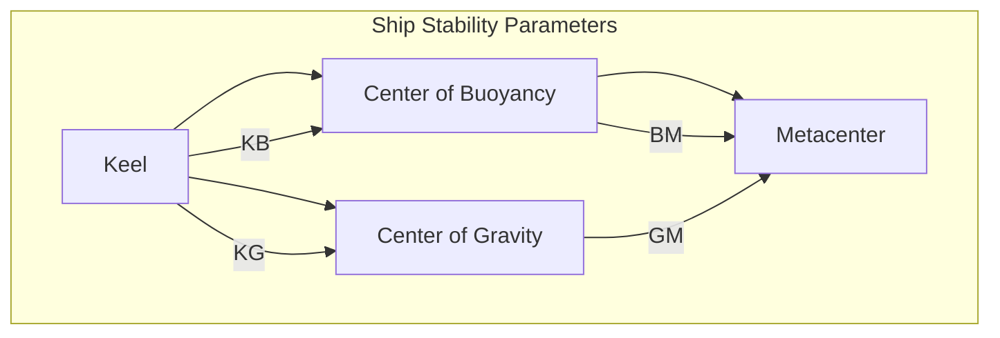
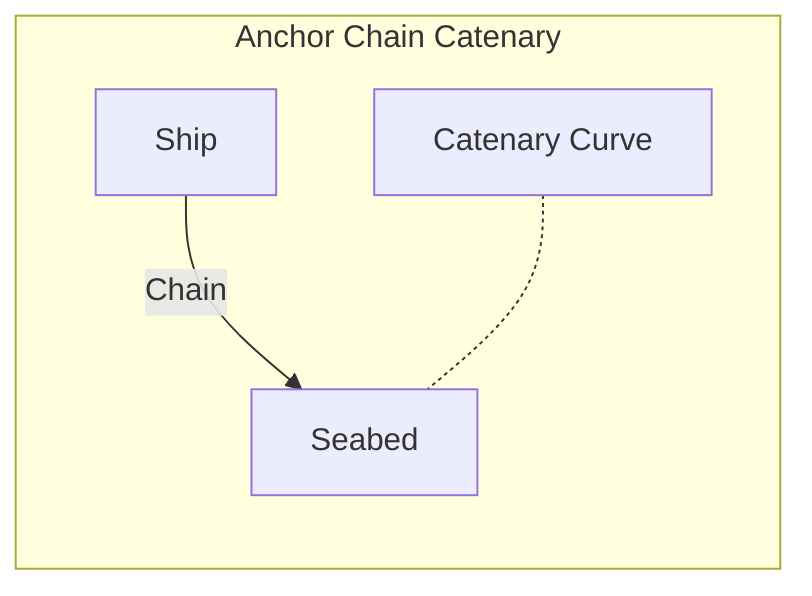

# Scientific formulas required for calculations in the project

## Implementation Status

1. **Computational Complexity**: Some formulas (e.g., Navier-Stokes equations) represent complex physical processes that would require full simulation engines.

2. **Different Abstraction Levels**: Some formulas are foundational while others are derived from them. Implementing all would create redundancy.

3. **Implementation Cost vs. Benefit**: Specialized formulas with limited application in ship simulation have lower priority.

4. **AssemblyScript Limitations**: AssemblyScript has performance constraints with complex mathematical operations and limited standard library support.

5. **Memory Constraints**: Implementing all formulas would increase the code footprint significantly.

For actual implementation details, see the source code with function implementations.

## Table of Contents

- [1. Hydrodynamics](#1-hydrodynamics)
- [2. Dynamics of Ship Motion](#2-dynamics-of-ship-motion)
- [3. Wave Mechanics](#3-wave-mechanics)
- [4. Propulsion](#4-propulsion)
- [5. Maneuvering](#5-maneuvering)
- [6. Structural Mechanics](#6-structural-mechanics)
- [7. Navigation and Positioning](#7-navigation-and-positioning)
- [8. Environmental Interactions](#8-environmental-interactions)
  - [8.1 Wind Force on Superstructure](#81-wind-force-on-superstructure)
  - [8.2 Atmospheric Fundamentals](#82-atmospheric-fundamentals)
  - [8.3 Thermodynamics](#83-thermodynamics)
  - [8.4 Moisture and Humidity](#84-moisture-and-humidity)
  - [8.5 Cloud Formation and Precipitation](#85-cloud-formation-and-precipitation)
  - [8.6 Radiative Transfer](#86-radiative-transfer)
  - [8.7 Wind and Turbulence](#87-wind-and-turbulence)
  - [8.8 Severe Weather Events](#88-severe-weather-events)
  - [8.9 Wave-Wind Interaction](#89-wave-wind-interaction)
  - [8.10 Visibility and Atmospheric Optics](#810-visibility-and-atmospheric-optics)
- [9. Mathematical Tools](#9-mathematical-tools)
- [10. Additional Maritime Systems](#10-additional-maritime-systems)
  - [10.1 Ship Stability](#101-ship-stability)
  - [10.2 Mooring and Anchor Systems](#102-mooring-and-anchor-systems)
  - [10.3 Numerical Weather Prediction](#103-numerical-weather-prediction)
  - [10.4 Statistical Weather Modeling](#104-statistical-weather-modeling)
- [11. Water Properties](#11-water-properties)

## **1. Hydrodynamics**

### Buoyancy and Stability (Archimedes’ Principle)

$$
F_{B} = \rho_{water} \cdot g \cdot V_{displaced}
$$

Where:

- $F_{B}$: Buoyant force (N)
- $\rho_{water}$: Density of water (kg/m³)
- $g$: Acceleration due to gravity (m/s²)
- $V_{displaced}$: Volume of water displaced by the ship (m³)

```typescript
const GRAVITY: f64 = 9.81;
const WATER_DENSITY: f64 = 1025.0; // kg/m³ (seawater)

/**
 * Calculate buoyant force using Archimedes' principle
 * @param displacedVolume Volume of water displaced by the ship (m³)
 * @returns Buoyant force (N)
 */
function calculateBuoyantForce(displacedVolume: f64): f64 {
  return WATER_DENSITY * GRAVITY * displacedVolume;
}
```

### Hydrostatic Pressure

$$
P = P_{atm} + \rho_{water} \cdot g \cdot h
$$

Where:

- $P$: Hydrostatic pressure (Pa)
- $P_{atm}$: Atmospheric pressure (Pa)
- $\rho_{water}$: Density of water (kg/m³)
- $g$: Acceleration due to gravity (m/s²)
- $h$: Depth below the water surface (m)

```typescript
const WATER_DENSITY: f64 = 1025.0; // kg/m³ (seawater)
const GRAVITY: f64 = 9.81; // m/s²

/**
 * Calculate hydrostatic pressure at a given depth
 * @param depth Depth below water surface (m)
 * @param atmosphericPressure Atmospheric pressure at surface (Pa)
 * @returns Pressure at depth (Pa)
 */
export function calculateHydrostaticPressure(
  depth: f64,
  atmosphericPressure: f64,
): f64 {
  return atmosphericPressure + WATER_DENSITY * GRAVITY * depth;
}
```

### Drag Force (Fluid resistance)

$$
F_{drag} = \frac{1}{2}\rho_{water} \cdot v^2 \cdot C_d \cdot A
$$

Where:

- $F_{drag}$: Drag force (N)
- $\rho_{water}$: Density of water (kg/m³)
- $v$: Velocity of the ship relative to water (m/s)
- $C_d$: Drag coefficient (dimensionless)
- $A$: Reference area (m²)

```typescript
const WATER_DENSITY: f64 = 1025.0; // kg/m³ (seawater)

/**
 * Calculate fluid drag force
 * @param velocity Relative velocity between object and fluid (m/s)
 * @param dragCoefficient Drag coefficient (dimensionless)
 * @param referenceArea Reference area (m²)
 * @param fluidDensity Density of the fluid (kg/m³)
 * @returns Drag force (N)
 */
export function calculateDragForce(
  velocity: f64,
  dragCoefficient: f64,
  referenceArea: f64,
  fluidDensity: f64 = WATER_DENSITY,
): f64 {
  return (
    0.5 * fluidDensity * velocity * velocity * dragCoefficient * referenceArea
  );
}
```

### Added Mass Effect

$$
m_{total} = m_{ship} + m_{added}
$$

Where:

- $m_{total}$: Total mass of the ship (kg)
- $m_{ship}$: Mass of the ship (kg)
- $m_{added}$: Added mass due to fluid motion (kg)

> **Application Context:** The added mass effect becomes particularly significant during rapid accelerations or decelerations, when the ship must move surrounding water along with it. This effect is more pronounced for bluff bodies and shallow water operations. For simulation purposes, added mass coefficients are typically estimated based on hull geometry or through experimental data, with different coefficients applied to different degrees of freedom.

---

## **2. Dynamics of Ship Motion**

### Newton’s Second Law

Linear:

$$
\mathbf{F} = m \cdot \mathbf{a}
$$

Where:

- $\mathbf{F}$: Net force (N)
- $m$: Mass of the ship (kg)
- $\mathbf{a}$: Acceleration (m/s²)

Angular (Rotation):

$$
\tau = I \cdot \alpha
$$

Where:

- $\tau$: Torque (N·m)
- $I$: Moment of inertia (kg·m²)
- $\alpha$: Angular acceleration (rad/s²)

### Equations of Motion (6 Degrees of Freedom)

- **Surge, Sway, Heave** (translation in x, y, z axes)
- **Roll, Pitch, Yaw** (rotation about x, y, z axes)



General form (for 6DOF rigid body motion):

For translational motion:

$$
m\frac{d\mathbf{v}}{dt} = \mathbf{F}_{\mathrm{ext}}
$$

Where:

- $m$: Mass matrix (kg)
- $\mathbf{v}$: Velocity vector (m/s)
- $\mathbf{F}_{\mathrm{ext}}$: External forces (N)

For rotational motion:

$$
I\frac{d\mathbf{\omega}}{dt} = \mathbf{\tau}
$$

Where:

- $\mathbf{\omega}$: Angular velocity vector (rad/s)
- $\mathbf{\tau}$: External torques (N·m)
- $I$: Inertia matrix (kg·m²)

---

## **3. Wave Mechanics**

### Linear Wave Theory (Airy Wave Theory)

Surface elevation:

$$
\eta(x, t) = a \cdot \cos(kx - \omega t)
$$

Where:

- $\eta$: Surface elevation (m)
- $a$: Wave amplitude (m)
- $k$: Wave number (rad/m)
- $\omega$: Angular frequency (rad/s)
- $x$: Position (m)
- $t$: Time (s)

```typescript
/**
 * Calculate wave surface elevation at position x and time t (Airy wave theory)
 * @param amplitude Wave amplitude (m)
 * @param waveNumber Wave number (rad/m)
 * @param angularFrequency Angular frequency (rad/s)
 * @param position Position x (m)
 * @param time Time t (s)
 * @returns Surface elevation (m)
 */
export function calculateWaveSurfaceElevation(
  amplitude: f64,
  waveNumber: f64,
  angularFrequency: f64,
  position: f64,
  time: f64,
): f64 {
  return amplitude * Math.cos(waveNumber * position - angularFrequency * time);
}
```

Dispersion relation:

$$
\omega^2 = gk \tanh(kh)
$$

Where:

- $\omega$: Angular frequency (rad/s)
- $g$: Acceleration due to gravity (m/s²)
- $h$: Water depth (m)
- $k$: Wave number (rad/m)

```typescript
const GRAVITY: f64 = 9.81; // m/s²

/**
 * Calculate angular frequency from wave number and water depth (dispersion relation)
 * @param waveNumber Wave number (rad/m)
 * @param waterDepth Water depth (m)
 * @returns Angular frequency (rad/s)
 */
function calculateAngularFrequency(
  waveNumber: f64,
  waterDepth: f64,
): f64 {
  return Math.sqrt(GRAVITY * waveNumber * Math.tanh(waveNumber * waterDepth));
}
```

Wave number $k$:

$$
k = \frac{2\pi}{\lambda}
$$

Where:

- $\lambda$: Wavelength (m)
- $k$: Wave number (rad/m)

```typescript
/**
 * Calculate wave number from wavelength
 * @param wavelength Wavelength (m)
 * @returns Wave number (rad/m)
 */
export function calculateWaveNumber(wavelength: f64): f64 {
  return (2.0 * Math.PI) / wavelength;
}
```

### Wave Force on Structures (Morison's Equation)

$$
F_{wave} = C_d \frac{1}{2}\rho D u|u| + C_m \rho \frac{\pi D^2}{4}\frac{du}{dt}
$$

Where:

- $F_{wave}$: Wave force (N)
- $C_d$: Drag coefficient (dimensionless)
- $C_m$: Inertia coefficient (dimensionless)
- $\rho$: Density of water (kg/m³)
- $D$: Diameter of the structure (m)
- $u$: Fluid velocity relative to structure (m/s)
- $\frac{du}{dt}$: Fluid acceleration relative to structure (m/s²)
- $|u|$: Absolute value of velocity (m/s)
- $t$: Time (s)

```typescript
const WATER_DENSITY: f64 = 1025.0; // kg/m³ (seawater)

/**
 * Calculate wave force on a slender structure using Morison's equation
 * @param dragCoefficient Drag coefficient
 * @param inertiaCoefficient Inertia coefficient
 * @param diameter Structure diameter (m)
 * @param fluidVelocity Fluid velocity (m/s)
 * @param fluidAcceleration Fluid acceleration (m/s²)
 * @returns Wave force per unit length (N/m)
 */
function calculateMorisonWaveForce(
  dragCoefficient: f64,
  inertiaCoefficient: f64,
  diameter: f64,
  fluidVelocity: f64,
  fluidAcceleration: f64,
): f64 {
  const dragTerm =
    dragCoefficient *
    0.5 *
    WATER_DENSITY *
    diameter *
    fluidVelocity *
    Math.abs(fluidVelocity);
  const inertiaTerm =
    inertiaCoefficient *
    WATER_DENSITY *
    Math.PI *
    diameter *
    diameter *
    0.25 *
    fluidAcceleration;
  return dragTerm + inertiaTerm;
}
```

> **Application Context:** Morison's equation is primarily used for calculating wave forces on slender structures where the diameter is small compared to the wavelength (D < 0.2λ). The first term represents drag force (dominant in high Keulegan-Carpenter number flows), while the second term represents inertial force (dominant in low KC number flows). For large structures where diffraction effects become important, alternative methods like potential flow theory or CFD should be considered.

---

## **4. Propulsion**

### Thrust Calculation

$$
T = \rho_{water} \cdot n^2 \cdot D^4 \cdot K_T
$$

Where:

- $T$: Thrust (N)
- $\rho_{water}$: Density of water (kg/m³)
- $K_T$: Thrust coefficient (dimensionless)
- $n$: Propeller rotation speed (rev/min)
- $D$: Propeller diameter (m)

```typescript
const WATER_DENSITY: f64 = 1025.0; // kg/m³ (seawater)

/**
 * Calculate thrust produced by a propeller
 * @param propellerRotationSpeed Propeller rotation speed (rev/min)
 * @param propellerDiameter Propeller diameter (m)
 * @param thrustCoefficient Thrust coefficient (dimensionless)
 * @returns Thrust (N)
 */
function calculatePropellerThrust(
  propellerRotationSpeed: f64,
  propellerDiameter: f64,
  thrustCoefficient: f64,
): f64 {
  return (
    WATER_DENSITY *
    propellerRotationSpeed *
    propellerRotationSpeed *
    Math.pow(propellerDiameter, 4) *
    thrustCoefficient
  );
}
```

### Power and Efficiency

$$
P = 2\pi \cdot n \cdot Q
$$

Where:

- $P$: Power (W)
- $Q$: Torque (Nm)
- $n$: Propeller rotation speed (r/m)

```typescript
/**
 * Calculate power produced by a propeller
 * @param propellerRotationSpeed Propeller rotation speed (rev/min)
 * @param torque Torque (Nm)
 * @returns Power (W)
 */
function calculatePropellerPower(
  propellerRotationSpeed: f64,
  torque: f64,
): f64 {
  return 2.0 * Math.PI * (propellerRotationSpeed / 60.0) * torque;
}
```

---

## **5. Maneuvering**

### Rudder Forces and Moments

Lift on Rudder (from lift theory):

$$
L = \frac{1}{2}\rho_{water} \cdot v^2 \cdot A_r \cdot C_L
$$

Where:

- $L$: Lift force (N)
- $C_L$: Lift coefficient (dimensionless)
- $A_r$: Area of the rudder (m²)
- $v$: Velocity of water relative to the rudder (m/s)
- $\rho_{water}$: Density of water (kg/m³)

```typescript
const WATER_DENSITY: f64 = 1025.0; // kg/m³ (seawater)

/**
 * Calculate rudder lift force
 * @param waterVelocity Velocity of water relative to the rudder (m/s)
 * @param rudderArea Area of the rudder (m²)
 * @param liftCoefficient Lift coefficient (dimensionless)
 * @returns Lift force (N)
 */
export function calculateRudderLift(
  waterVelocity: f64,
  rudderArea: f64,
  liftCoefficient: f64,
): f64 {
  return (
    0.5 *
    WATER_DENSITY *
    waterVelocity *
    waterVelocity *
    rudderArea *
    liftCoefficient
  );
}
```



> **Application Context:** The effectiveness of a rudder depends on the flow velocity across it. This is why rudders become less effective at low speeds. The lift coefficient $C_L$ is approximately linear with angle of attack up to about 15°, after which stall may occur. For simulation purposes, consider the effect of propeller wash, which increases local flow velocity and improves rudder effectiveness.

### Turning Radius

Simple model (steady turning radius $R$):

$$
R = \frac{V^2}{g \tan(\delta) C_r}
$$

Where:

- $R$: Turning radius (m)
- $V$: Speed of the ship (m/s)
- $g$: Acceleration due to gravity (m/s²)
- $\tan(\delta)$: Tangent of the rudder angle (dimensionless)
- $\delta$: Rudder angle (radians)
- $C_r$: Turning coefficient (dimensionless)

```typescript
const GRAVITY: f64 = 9.81; // m/s²

/**
 * Calculate steady-state turning radius
 * @param shipSpeed Ship speed (m/s)
 * @param rudderAngle Rudder angle (radians)
 * @param turningCoefficient Ship-specific turning coefficient
 * @returns Turning radius (m)
 */
export function calculateTurningRadius(
  shipSpeed: f64,
  rudderAngle: f64,
  turningCoefficient: f64,
): f64 {
  return (
    (shipSpeed * shipSpeed) /
    (GRAVITY * Math.tan(rudderAngle) * turningCoefficient)
  );
}
```

> **Application Context:** This formula provides a simplified estimation for the steady-state turning radius. It assumes constant speed and rudder angle after the initial transient response has settled. The turning coefficient $C_r$ is ship-specific and must be determined empirically. For more accurate dynamic maneuvering simulations, consider using Nomoto's model or a full 3-DOF horizontal plane model that accounts for transient behavior.

### Nomoto's First-order Model (Steering Dynamics)

$$
T \frac{d\psi}{dt} + \psi = K\delta
$$

Where:

- $\psi$: Yaw angle (heading) (rad)
- $\delta$: Rudder angle (rad)
- $T$: Time constant (s)
- $K$: Gain constant (dimensionless)

> **Application Context:** Nomoto's model provides a simplified representation of ship steering dynamics that is computationally efficient for real-time simulations. The first-order model is adequate for ships with good steering behavior, while a second-order model may be needed for vessels with more complex dynamics. The parameters $T$ and $K$ are determined from turning tests or more detailed hydrodynamic models.

---

## **6. Structural Mechanics**

### Hull Stress and Strain (Linear Elasticity)

Stress ($\sigma$):

$$
\sigma = \frac{F}{A}
$$

Where:

- $\sigma$: Stress (Pa)
- $F$: Force (N)
- $A$: Cross-sectional area (m²)

```typescript
/**
 * Calculate stress based on force and area
 * @param force Force (N)
 * @param area Cross-sectional area (m²)
 * @returns Stress (Pa)
 */
export function calculateStress(force: f64, area: f64): f64 {
  return force / area;
}
```

Strain ($\epsilon$):

$$
\epsilon = \frac{\Delta L}{L}
$$

Where:

- $\epsilon$: Strain (dimensionless)
- $\Delta L$: Change in length (m)
- $L$: Original length (m)

```typescript
/**
 * Calculate strain based on change in length
 * @param originalLength Original length (m)
 * @param changeInLength Change in length (m)
 * @returns Strain (dimensionless)
 */
export function calculateStrain(originalLength: f64, changeInLength: f64): f64 {
  return changeInLength / originalLength;
}
```

Hooke’s Law:

$$
\sigma = E \cdot \epsilon
$$

Where:

- $E$: Young's modulus (Pa)
- $\epsilon$: Strain (dimensionless)

```typescript
/**
 * Calculate stress using Hooke's law
 * @param strain Strain (dimensionless)
 * @param youngsModulus Young's modulus (Pa)
 * @returns Stress (Pa)
 */
export function calculateHookesLaw(strain: f64, youngsModulus: f64): f64 {
  return youngsModulus * strain;
}
```

### Beam Theory (Bending Moments in Hull)

Bending stress:

$$
\sigma_b = \frac{M y}{I}
$$

Where:

- $\sigma_b$: Bending stress (Pa)
- $M$: Bending moment (N·m)
- $y$: Distance from neutral axis (m)
- $I$: Second moment of inertia (m⁴)

```typescript
/**
 * Calculate bending stress
 * @param bendingMoment Bending moment (N·m)
 * @param distanceFromNeutralAxis Distance from neutral axis (m)
 * @param secondMomentOfArea Second moment of area (m⁴)
 * @returns Bending stress (Pa)
 */
export function calculateBendingStress(
  bendingMoment: f64,
  distanceFromNeutralAxis: f64,
  secondMomentOfArea: f64,
): f64 {
  return (bendingMoment * distanceFromNeutralAxis) / secondMomentOfArea;
}
```

---

## **7. Navigation and Positioning**

### Dead Reckoning

Position update:

$$
x_{new} = x_{old} + V \cdot \Delta t \cdot \cos(\theta)
$$

Where:

- $x_{new}$: New x-coordinate
- $x_{old}$: Old x-coordinate
- $V$: Speed (m/s)
- $\Delta t$: Time step (s)
- $\theta$: Heading angle (radians)

$$
y_{new} = y_{old} + V \cdot \Delta t \cdot \sin(\theta)
$$

Where:

- $y_{new}$: New y-coordinate
- $y_{old}$: Old y-coordinate
- $V$: Speed (m/s)
- $\Delta t$: Time step (s)
- $\theta$: Heading angle (radians)

```typescript
/**
 * Updates ship position using dead reckoning
 * @param position Current position [x, y]
 * @param speed Ship speed (m/s)
 * @param heading Ship heading in radians
 * @param deltaTime Time step (s)
 * @returns Updated position [x, y]
 */
function updatePositionDeadReckoning(
  position: Float64Array,
  speed: f64,
  heading: f64,
  deltaTime: f64,
): Float64Array {
  const newPosition = new Float64Array(2);
  newPosition[0] = position[0] + speed * deltaTime * Math.cos(heading);
  newPosition[1] = position[1] + speed * deltaTime * Math.sin(heading);
  return newPosition;
}
```

### Great Circle Navigation

Distance:

$$
d = R \cdot \arccos\left(\sin\phi_1\sin\phi_2 + \cos\phi_1\cos\phi_2\cos(\Delta \lambda)\right)
$$

Where:

- $d$: Distance (m)
- $R$: Radius of the Earth (m)
- $\phi_1, \phi_2$: Latitudes (radians)
- $\Delta \lambda$: Difference in longitudes (radians)
- $\sin, \cos$: Sine and cosine functions
- $\arccos$: Inverse cosine function

```typescript
const EARTH_RADIUS: f64 = 6371000.0; // m

/**
 * Calculate great circle distance between two points on Earth
 * @param lat1 Latitude of first point (radians)
 * @param lon1 Longitude of first point (radians)
 * @param lat2 Latitude of second point (radians)
 * @param lon2 Longitude of second point (radians)
 * @returns Distance (meters)
 */
export function calculateGreatCircleDistance(
  lat1: f64,
  lon1: f64,
  lat2: f64,
  lon2: f64,
): f64 {
  const deltaLon = lon2 - lon1;
  const cosLat1 = Math.cos(lat1);
  const cosLat2 = Math.cos(lat2);
  const sinLat1 = Math.sin(lat1);
  const sinLat2 = Math.sin(lat2);

  const term1 = sinLat1 * sinLat2;
  const term2 = cosLat1 * cosLat2 * Math.cos(deltaLon);

  // Use haversine formula for better numerical stability
  const centralAngle = Math.acos(Math.max(Math.min(term1 + term2, 1.0), -1.0));
  return EARTH_RADIUS * centralAngle;
}

```



> **Application Context:** Great circle routes represent the shortest distance between two points on a sphere (Earth), following the arc of a circle whose plane passes through the Earth's center. While shorter than rhumb lines (constant bearing routes), great circle navigation requires continuous course adjustments, making it most beneficial for long voyages. For simulation purposes, intermediate waypoints along a great circle route are typically calculated for practical navigation implementation.

---

## **8. Environmental Interactions**

### 8.1 Wind Force on Superstructure

$$
F_{wind} = \frac{1}{2}\rho_{air} v_{wind}^2 C_{drag} A
$$

Where:

- $F_{wind}$: Wind force (N)
- $\rho_{air}$: Density of air (kg/m³)
- $v_{wind}$: Wind speed (m/s)
- $C_{drag}$: Drag coefficient (dimensionless)
- $A$: Reference area (m²)

```typescript
const AIR_DENSITY: f64 = 1.225; // kg/m³ (standard air density)

/**
 * Calculate wind force on ship superstructure
 * @param windSpeed Wind speed (m/s)
 * @param dragCoefficient Drag coefficient (dimensionless)
 * @param referenceArea Reference area (m²)
 * @returns Wind force (N)
 */
export function calculateWindForce(
  windSpeed: f64,
  dragCoefficient: f64,
  referenceArea: f64,
): f64 {
  return (
    0.5 * AIR_DENSITY * windSpeed * windSpeed * dragCoefficient * referenceArea
  );
}
```

### 8.2 Atmospheric Fundamentals

#### Navier-Stokes Equations for Atmospheric Flow

$$
\rho\frac{D\mathbf{u}}{Dt} = -\nabla p - \rho g \hat{z} + \mu\nabla^2\mathbf{u}
$$

Where:

- $\rho$: Fluid density (kg/m³)
- $\mathbf{u}$: Velocity vector field (m/s)
- $\frac{D}{Dt}$: Material derivative (following fluid motion)
- $\nabla p$: Pressure gradient (Pa/m)
- $g$: Acceleration due to gravity (m/s²)
- $\hat{z}$: Unit vector in vertical direction
- $\mu$: Dynamic viscosity coefficient (kg/m·s)
- $\nabla^2$: Laplacian operator

#### Simplified (Geostrophic wind)

$$
f\mathbf{k} \times \mathbf{v} = -\frac{1}{\rho}\nabla p
$$

Where:

- $f$: Coriolis parameter (s⁻¹), given by $f = 2\Omega\sin\phi$ where $\Omega$ is Earth's angular velocity and $\phi$ is latitude
- $\mathbf{k}$: Unit vector in vertical direction
- $\mathbf{v}$: Horizontal wind velocity vector (m/s)
- $\nabla p$: Horizontal pressure gradient (Pa/m)
- $\rho$: Air density (kg/m³)

### 8.3 Thermodynamics

#### Ideal Gas Law for Atmosphere

$$
p = \rho R T
$$

Where:

- $p$: Pressure (Pa)
- $\rho$: Density (kg/m³)
- $R$: Specific gas constant for air (≈287 J/kg·K)
- $T$: Temperature (K)

#### Adiabatic Processes

Dry adiabatic lapse rate ($\Gamma_d$):

$$
\Gamma_d = \frac{g}{C_p} \approx 9.8\,^\circ C/km
$$

Where:

- $g$: Acceleration due to gravity (m/s²)
- $C_p$: Specific heat capacity of dry air at constant pressure (J/kg·K)

Moist adiabatic lapse rate ($\Gamma_m$):
Typically $4-8\,^\circ C/km$, varies with moisture and temperature.

#### Potential Temperature ($\theta$)

$$
\theta = T\left(\frac{p_0}{p}\right)^{R/C_p}
$$

Where:

- $\theta$: Potential temperature (K)
- $T$: Actual temperature (K)
- $p_0$: Reference pressure, typically 100,000 Pa
- $p$: Actual pressure (Pa)
- $R$: Specific gas constant for dry air (J/kg·K)
- $C_p$: Specific heat capacity at constant pressure (J/kg·K)

### 8.4 Moisture and Humidity

#### Relative Humidity (RH%)

$$
RH = \frac{e}{e_s} \times 100
$$

Where:

- $e$: Vapor pressure (Pa)
- $e_s$: Saturation vapor pressure (Pa)

```typescript
/**
 * Calculate relative humidity
 * @param vaporPressure Actual vapor pressure (Pa)
 * @param saturationVaporPressure Saturation vapor pressure (Pa)
 * @returns Relative humidity (%)
 */
export function calculateRelativeHumidity(
  vaporPressure: f64,
  saturationVaporPressure: f64,
): f64 {
  return (vaporPressure / saturationVaporPressure) * 100.0;
}
```

#### Clausius-Clapeyron Equation (saturation vapor pressure)

$$
e_s(T) = e_0 \exp\left[\frac{L_v}{R_v}\left(\frac{1}{T_0}-\frac{1}{T}\right)\right]
$$

Where:

- $e_s(T)$: Saturation vapor pressure at temperature T (Pa)
- $e_0$: Reference saturation vapor pressure at reference temperature $T_0$ (Pa)
- $L_v$: Latent heat of vaporization of water (J/kg)
- $R_v$: Specific gas constant for water vapor (≈461.5 J/kg·K)
- $T_0$: Reference temperature (typically 273.16 K)
- $T$: Actual temperature (K)

### 8.5 Cloud Formation and Precipitation

#### Lifted Condensation Level (LCL)

Approximate height at which condensation (clouds) forms:

$$
z_{LCL} \approx \frac{T - T_d}{\Gamma_d - \Gamma_{dew}}
$$

Where:

- $z_{LCL}$: Height of lifted condensation level (m)
- $T$: Surface air temperature (°C or K)
- $T_d$: Surface dew point temperature (°C or K)
- $\Gamma_d$: Dry adiabatic lapse rate (°C/m or K/m)
- $\Gamma_{dew}$: Dew point lapse rate (°C/m or K/m)

#### Rainfall Rate (Marshall-Palmer distribution)

Drop-size distribution for rainfall intensity $R$:

$$
N(D) = N_0 e^{-\Lambda D}, \quad \text{with} \quad \Lambda = 4.1\,R^{-0.21}
$$

Where:

- $N(D)$: Number of drops with diameter $D$ per unit volume per unit diameter interval
- $N_0$: Distribution parameter (typically 8000 m⁻³·mm⁻¹)
- $\Lambda$: Distribution slope parameter (mm⁻¹)
- $R$: Rainfall rate (mm/h)
- $D$: Raindrop diameter (mm)

### 8.6 Radiative Transfer

#### Solar Radiation (Insolation)

Simplified formula for solar energy input:

$$
Q = S_0(1 - \alpha)\cos(Z)
$$

Where:

- $S_0$: Solar constant (≈1361 W/m²)
- $\alpha$: Albedo (dimensionless)
- $Z$: Zenith angle of sun (radians)

```typescript
const SOLAR_CONSTANT: f64 = 1361.0; // W/m²

/**
 * Calculate solar radiation on horizontal surface
 * @param albedo Surface reflectivity (dimensionless)
 * @param zenithAngle Sun's zenith angle (radians)
 * @returns Solar radiation flux (W/m²)
 */
export function calculateSolarRadiation(albedo: f64, zenithAngle: f64): f64 {
  return SOLAR_CONSTANT * (1.0 - albedo) * Math.cos(zenithAngle);
}
```

#### Longwave Radiation (Stefan-Boltzmann Law)

$$
E = \epsilon\sigma T^4
$$

Where:

- $\epsilon$: Emissivity (dimensionless)
- $\sigma$: Stefan-Boltzmann constant (5.67×10⁻⁸ W/m²K⁴)
- $T$: Temperature (K)

```typescript
const STEFAN_BOLTZMANN: f64 = 5.67e-8; // W/m²K⁴

/**
 * Calculate longwave radiation using Stefan-Boltzmann Law
 * @param emissivity Surface emissivity (dimensionless)
 * @param temperature Surface temperature (K)
 * @returns Radiated energy flux (W/m²)
 */
export function calculateLongwaveRadiation(
  emissivity: f64,
  temperature: f64,
): f64 {
  return emissivity * STEFAN_BOLTZMANN * Math.pow(temperature, 4);
}
```

### 8.7 Wind and Turbulence

#### Wind Shear

$$
\frac{du}{dz}
$$

#### Vertical wind profile

Logarithmic profile for near-surface winds:

$$
u(z) = \frac{u_*}{k}\ln\frac{z}{z_0}
$$

Where:

- $u_*$: friction velocity (m/s)
- $z_0$: surface roughness (m)
- $k$: von Kármán constant (≈0.4)

### 8.8 Severe Weather Events

#### Cyclone Pressure-Wind Relationship (Gradient Wind Approximation)

Balance of pressure gradient, Coriolis, and centripetal forces:

$$
v_g = -\frac{f r}{2} + \sqrt{\left(\frac{f r}{2}\right)^2 + \frac{r}{\rho}\frac{\partial p}{\partial r}}
$$

Where:

- $v_g$: Gradient wind speed (m/s)
- $r$: Radius from cyclone center (m)

### 8.9 Wave-Wind Interaction

#### Wave Generation by Wind (Pierson-Moskowitz Spectrum)

Wave energy spectrum:

$$
S(\omega) = \frac{\alpha g^2}{\omega^5}\exp\left[-\frac{\beta g^4}{\omega^4 U_{10}^4}\right]
$$

Where:

- $S(\omega)$: Wave energy spectral density (m²·s)
- $\alpha$: Phillips constant (≈0.0081, dimensionless)
- $\beta$: Constant (≈0.74, dimensionless)
- $g$: Acceleration due to gravity (m/s²)
- $\omega$: Angular frequency (rad/s)
- $U_{10}$: Wind speed at 10 m height (m/s)

### 8.10 Visibility and Atmospheric Optics

#### Beer–Lambert law (visibility through fog/haze)

$$
I = I_0 e^{-\sigma x}
$$

Where:

- $I$: Light intensity after passing through medium
- $I_0$: Initial light intensity
- $\sigma$: Attenuation coefficient (m⁻¹)
- $x$: Distance light travels through medium (m)

```typescript
/**
 * Calculate visibility using Beer-Lambert law
 * @param initialIntensity Initial light intensity
 * @param attenuationCoefficient Attenuation coefficient (m⁻¹)
 * @param distance Distance (m)
 * @returns Light intensity after attenuation
 */
export function calculateVisibility(
  initialIntensity: f64,
  attenuationCoefficient: f64,
  distance: f64,
): f64 {
  return initialIntensity * Math.exp(-attenuationCoefficient * distance);
}
```

---

## **9. Mathematical Tools**

- **Numerical Integration (Euler, RK4)**:

    > **Note:** The Euler method is a first-order approximation for solving ordinary differential equations. It is simple and computationally efficient, but introduces a local truncation error proportional to the square of the time step ($O(\Delta t^2)$) and a global error proportional to the time step ($O(\Delta t)$). For higher accuracy, methods like Runge-Kutta (RK4) are preferred.

  - $x_{n+1} = x_n + \Delta t \cdot f(x_n, t_n)$

  Where:

  - $x_{n+1}$: Next state
  - $x_n$: Current state
  - $\Delta t$: Time step
  - $f(x_n, t_n)$: Function to integrate
  - $t_n$: Current time

- **Differential Equations (ODE)**:

  - For modeling ship dynamics, stability, and propulsion.

- **Interpolation and Spline Methods**:

  - For hull geometry modeling.

- **Optimization Algorithms**:

  - Path optimization, fuel consumption minimization.

---

## **10. Additional Maritime Systems**

### 10.1 Ship Stability

#### Metacentric Height (GM)

$$
GM = KB + BM - KG
$$

Where:

- $GM$: Metacentric height (m)
- $KB$: Height of center of buoyancy above keel (m)
- $BM$: Distance from center of buoyancy to metacenter (m)
- $KG$: Height of center of gravity above keel (m)

```typescript
/**
 * Calculate metacentric height
 * @param kb Height of center of buoyancy above keel (m)
 * @param bm Distance from center of buoyancy to metacenter (m)
 * @param kg Height of center of gravity above keel (m)
 * @returns Metacentric height (m)
 */
export function calculateMetacentricHeight(kb: f64, bm: f64, kg: f64): f64 {
  return kb + bm - kg;
}
```



> **Application Context:** Metacentric height (GM) is a crucial stability parameter. A positive GM indicates initial stability, with larger values making the vessel more stiff (quick to right itself but with uncomfortable motion). A negative GM indicates instability. GM varies with loading conditions and is critical for simulation of cargo operations or damaged stability scenarios. The formula provided is for small angles of heel only; large angle stability requires GZ curve calculations.

#### Righting Moment

$$
M = \Delta \cdot GZ
$$

Where:

- $M$: Righting moment (N·m)
- $\Delta$: Displacement (N)
- $GZ$: Righting arm (m)

```typescript
/**
 * Calculate righting moment
 * @param displacement Ship displacement (N)
 * @param rightingArm Righting arm GZ (m)
 * @returns Righting moment (N·m)
 */
export function calculateRightingMoment(
  displacement: f64,
  rightingArm: f64,
): f64 {
  return displacement * rightingArm;
}
```

#### Righting Arm for Small Angles

$$
GZ = GM \cdot \sin(\theta)
$$

Where:

- $GZ$: Righting arm (m)
- $GM$: Metacentric height (m)
- $\theta$: Heel angle (radians)

```typescript
/**
 * Calculate righting arm for small angles
 * @param metacentricHeight Metacentric height GM (m)
 * @param heelAngle Heel angle (radians)
 * @returns Righting arm GZ (m)
 */
export function calculateSmallAngleRightingArm(
  metacentricHeight: f64,
  heelAngle: f64,
): f64 {
  return metacentricHeight * Math.sin(heelAngle);
}
```

> **Application Context:** For small heel angles, the righting arm GZ can be approximated as GM·sin(θ). This simplification breaks down at larger angles where the full GZ curve must be calculated from the hull geometry. This function provides a quick estimate useful for initial stability calculations or for vessels with small angles of heel.

### 10.2 Mooring and Anchor Systems

#### Catenary Curve Equation (for anchor chain)

$$
y = \frac{H}{w}\left(\cosh\frac{w x}{H}-1\right)
$$

Where:

- $y$: Vertical coordinate (m)
- $x$: Horizontal coordinate (m)
- $H$: Horizontal tension (N)
- $w$: Weight per unit length (N/m)

```typescript
/**
 * Calculate catenary curve y-coordinate for mooring/anchor chains
 * @param horizontalTension Horizontal tension (N)
 * @param weightPerLength Weight per unit length (N/m)
 * @param horizontalPosition x-coordinate (m)
 * @returns Vertical coordinate y (m)
 */
export function calculateCatenaryY(
  horizontalTension: f64,
  weightPerLength: f64,
  horizontalPosition: f64,
): f64 {
  const ratio = weightPerLength / horizontalTension;
  return (
    (horizontalTension / weightPerLength) *
    (Math.cosh(ratio * horizontalPosition) - 1.0)
  );
}
```



> **Application Context:** The catenary equation describes the shape of an anchor chain or mooring line under its own weight. This formulation assumes a perfectly flexible, uniform line with no elastic stretch. For simulation purposes, the catenary shape determines the horizontal restoring force as a vessel moves from its anchored position. More sophisticated mooring simulations may incorporate line elasticity, hydrodynamic drag on the lines, and seafloor interaction models.

#### Mooring Line Restoring Force

For a catenary mooring line, the horizontal restoring force can be approximated based on the scope, horizontal distance, and weight per unit length:

```typescript
/**
 * Calculate horizontal restoring force for a catenary mooring line
 * @param scope Total length of mooring line (m)
 * @param horizontalDistance Horizontal distance from anchor to vessel (m)
 * @param weightPerLength Weight per unit length (N/m)
 * @returns Horizontal restoring force (N)
 */
export function calculateMooringRestoringForce(
  scope: f64,
  horizontalDistance: f64,
  weightPerLength: f64,
): f64 {
  // This is a simplification - full solution requires solving transcendental equation
  if (horizontalDistance >= scope) {
    return f64.POSITIVE_INFINITY; // Line is taut
  }

  const verticalDistance = Math.sqrt(
    scope * scope - horizontalDistance * horizontalDistance,
  );
  return (
    (weightPerLength * horizontalDistance) / ((2.0 * verticalDistance) / scope)
  );
}
```

> **Application Context:** This function provides a simplified model for calculating the restoring force of a mooring line as a vessel moves away from its anchored position. When the horizontal distance equals the total line length (scope), the line becomes completely taut with effectively infinite tension. For more accurate modeling, the full catenary equations would need to be solved iteratively.

### 10.3 Numerical Weather Prediction

#### Primitive Equations of Atmospheric Motion

Set of coupled equations (momentum, continuity, thermodynamic, moisture):

- Momentum equations (including Coriolis)
- Thermodynamic equation (energy conservation)  
- Moisture conservation equation
- Continuity equation (mass conservation)

General form:

$$
\frac{\partial X}{\partial t} + \mathbf{u}\cdot\nabla X = S(X)
$$

Where:

- $X$: State variable (e.g., temperature, wind components)
- $\frac{\partial X}{\partial t}$: Local rate of change of state variable with time
- $\mathbf{u}\cdot\nabla X$: Advection term (transport by flow)
- $S(X)$: Source/sink terms (e.g., diabatic heating, friction)
- $\nabla$: Del operator (partial derivatives with respect to spatial coordinates)

### 10.4 Statistical Weather Modeling

#### Markov Chain models (weather states transitions)

State-to-state probability:

$$
P(X_{t+1}=j|X_t=i)
$$

Where:

- $X_t$: Weather state at time t
- $i, j$: Different weather states

---

## **11. Water Properties**

Water density variations significantly impact maritime operations through changes in buoyancy, stability, and hydrodynamic forces. These variations occur between salt water and fresh water environments, and are affected by temperature and pressure conditions.

### Water Density Calculation

#### UNESCO Equation of State (Simplified)

The full UNESCO equation is complex, but a simplified approximation is:

$$
\rho_w = \rho_0 + \alpha \cdot S - \beta \cdot T
$$

Where:

- $\rho_w$: Water density (kg/m³)
- $\rho_0$: Reference density of fresh water (≈1000 kg/m³)
- $S$: Salinity (psu, practical salinity units)
- $T$: Temperature (°C)
- $\alpha$: Salinity coefficient (≈0.8 kg/m³/psu)
- $\beta$: Temperature coefficient (≈0.2 kg/m³/°C)

```typescript
/**
 * Calculate water density based on temperature and salinity
 * Simplified approximation valid for typical oceanic conditions
 * @param temperature Water temperature (°C)
 * @param salinity Water salinity (psu)
 * @returns Water density (kg/m³)
 */
export function calculateWaterDensity(
  temperature: f64,
  salinity: f64
): f64 {
  return 1000.0 + 0.8 * salinity - 0.2 * temperature;
}
```

#### Fresh Water Density with Temperature

Fresh water has maximum density at approximately 4°C, which is important for ice formation dynamics:

$$
\rho_{fresh} = 1000 \cdot \left(1 - \frac{|T - 4|^{1.7}}{2120}\right)
$$

Where:

- $\rho_{fresh}$: Fresh water density (kg/m³)
- $T$: Temperature (°C)

```typescript
/**
 * Calculate fresh water density based on temperature
 * Approximation accounting for density maximum at 4°C
 * @param temperature Water temperature (°C)
 * @returns Fresh water density (kg/m³)
 */
export function calculateFreshWaterDensity(
  temperature: f64
): f64 {
  return 1000.0 * (1.0 - Math.pow(Math.abs(temperature - 4.0), 1.7) / 2120.0);
}
```

### Lookup Table Approach

For performance-critical applications, a lookup table with interpolation provides computational efficiency:

```typescript
/**
 * Water density lookup table
 * First index: temperature (0-30°C in 5°C steps)
 * Second index: 0=fresh water, 1=seawater (35 psu)
 */
const WATER_DENSITY_TABLE: Array<Array<f64>> = [
  [999.8, 1028.1], // 0°C
  [999.9, 1027.7], // 5°C
  [999.7, 1026.9], // 10°C
  [999.1, 1025.9], // 15°C
  [998.2, 1024.7], // 20°C
  [997.0, 1023.3], // 25°C
  [995.6, 1021.7]  // 30°C
];

/**
 * Get water density from lookup table with linear interpolation
 * @param temperature Water temperature (°C)
 * @param isSaltWater Whether to use salt water values (true) or fresh water (false)
 * @returns Interpolated water density (kg/m³)
 */
export function getWaterDensityFromTable(
  temperature: f64,
  isSaltWater: bool
): f64 {
  // Clamp temperature to table bounds
  const clampedTemp = Math.max(0.0, Math.min(30.0, temperature));
  
  // Calculate indices and interpolation factor
  const lowerIndex = Math.floor(clampedTemp / 5.0);
  const upperIndex = Math.min(6, lowerIndex + 1);
  const factor = (clampedTemp - lowerIndex * 5.0) / 5.0;
  
  // Select column based on water type
  const column: i32 = isSaltWater ? 1 : 0;
  
  // Perform linear interpolation between nearest values
  const lowerValue = WATER_DENSITY_TABLE[lowerIndex][column];
  const upperValue = WATER_DENSITY_TABLE[upperIndex][column];
  
  return lowerValue + factor * (upperValue - lowerValue);
}
```

### Effects of Density Variation on Maritime Simulation

The variation in water density affects several key aspects of maritime simulation:

1. **Buoyancy Force** - Objects experience ~2.5% greater buoyancy in salt water than fresh water

2. **Draft Changes** - A vessel will sit slightly higher in salt water than in fresh water:

   $$\text{Draft change} = \text{Current draft} \times \frac{\rho_{current} - \rho_{new}}{\rho_{new}}$$

3. **Stability Parameters** - Metacentric height and righting moments are affected by water density

4. **Propulsion Efficiency** - Propeller performance varies with water density

5. **Ice Formation Dynamics** - Fresh water's maximum density at 4°C creates unique circulation patterns

6. **Sound Propagation** - Water density affects acoustic transmission characteristics

> **Application Context:** In maritime simulations spanning different environments (open ocean, coastal regions, rivers, Arctic waters), accounting for water density variations improves accuracy of vessel behavior. For high-precision simulations involving critical operations like heavy load transport or ice navigation, density variation can substantially affect stability and propulsion requirements.

### Comprehensive Water Density Model

For a comprehensive approach that includes effects of depth (pressure), temperature, and salinity:

```typescript
/**
 * Get water density based on temperature, salinity and depth
 * More comprehensive approach that accounts for ice formation in very cold conditions
 * @param temperature Water temperature (°C)
 * @param salinity Water salinity (psu)
 * @param depth Depth below surface (m)
 * @returns Water density (kg/m³)
 */
export function getComprehensiveWaterDensity(
  temperature: f64,
  salinity: f64,
  depth: f64
): f64 {
  // Handle ice formation case (simplified)
  if (temperature < -0.5 * salinity / 10.0) {
    return 916.8; // Approximate density of ice
  }
  
  // Basic density calculation
  let density = 1000.0 + 0.8 * salinity - 0.2 * temperature;
  
  // Add pressure effect (very minor for typical ship simulation depths)
  if (depth > 10.0) {
    // Approximate 0.005 kg/m³ increase per meter depth below 10m
    density += 0.005 * (depth - 10.0);
  }
  
  return density;
}
```

### Integration with Buoyancy Calculations

To incorporate water density variations into buoyancy calculations:

```typescript
/**
 * Calculate buoyant force with variable water density
 * @param displacedVolume Volume of water displaced by the ship (m³)
 * @param temperature Water temperature (°C)
 * @param isSaltWater Whether in salt water (true) or fresh water (false)
 * @returns Buoyant force (N)
 */
export function calculateBuoyantForceWithDensity(
  displacedVolume: f64,
  temperature: f64,
  isSaltWater: bool
): f64 {
  const waterDensity = getWaterDensityFromTable(temperature, isSaltWater);
  return waterDensity * GRAVITY * displacedVolume;
}
```

---
