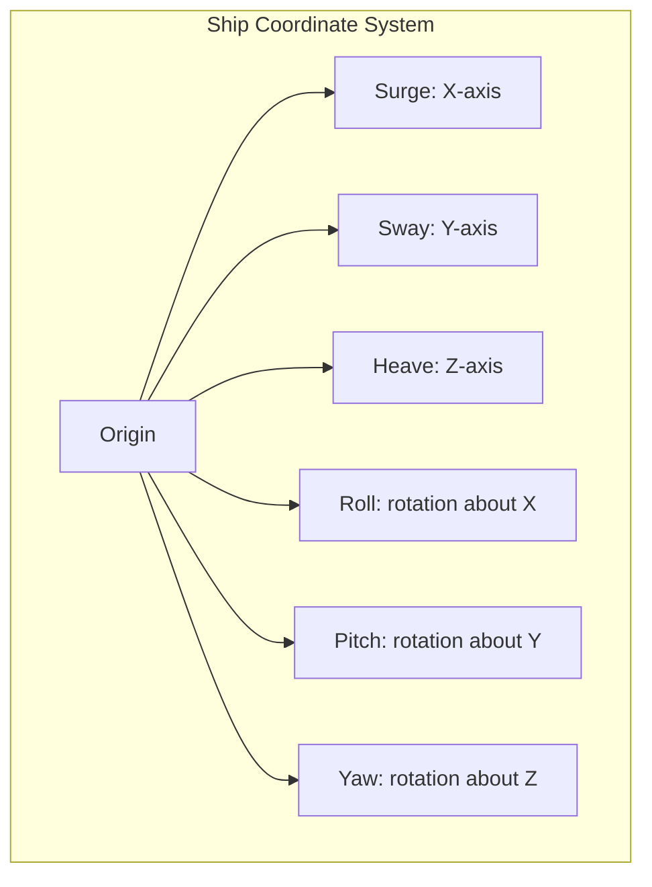
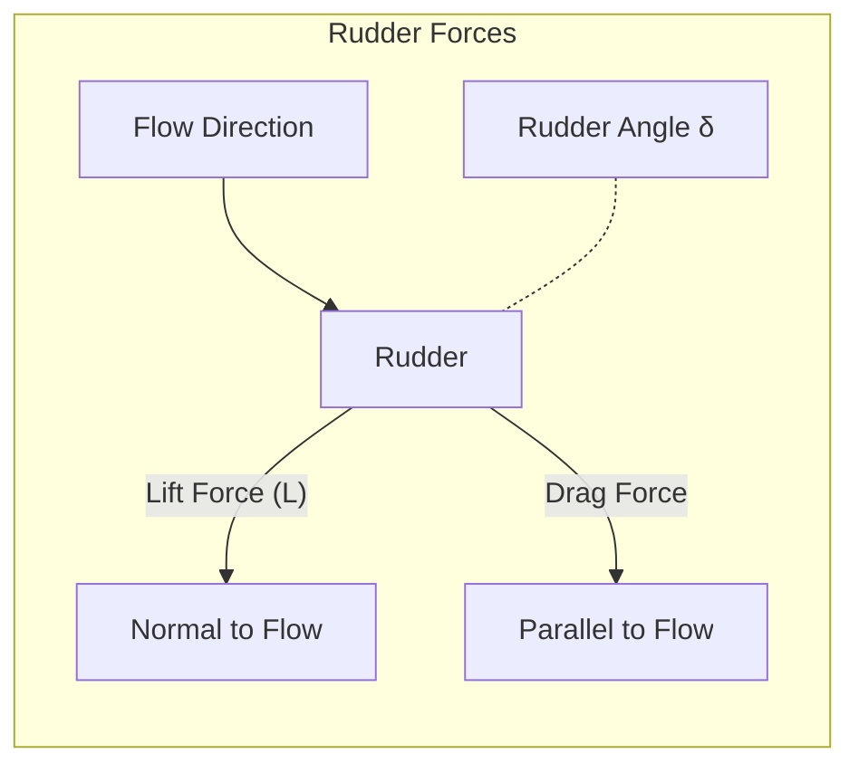
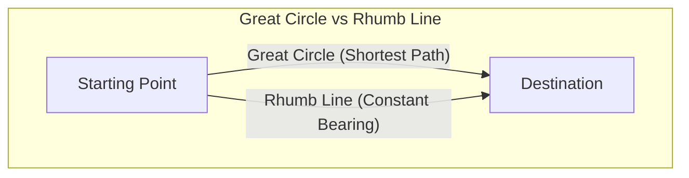
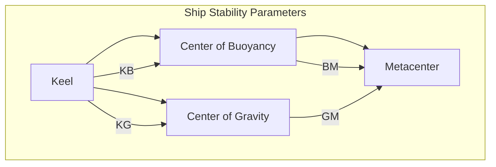
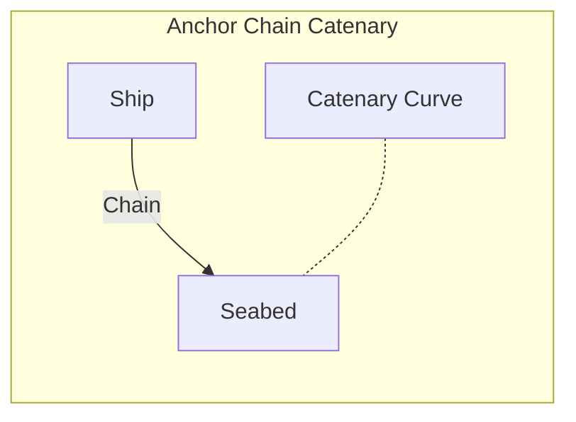

# Scientific formulas required for calculations in the project

## Table of Contents

- [1. Hydrodynamics](#1-hydrodynamics)
- [2. Dynamics of Ship Motion](#2-dynamics-of-ship-motion)
- [3. Wave Mechanics](#3-wave-mechanics)
- [4. Propulsion](#4-propulsion)
- [5. Maneuvering](#5-maneuvering)
- [6. Structural Mechanics](#6-structural-mechanics)
- [7. Navigation and Positioning](#7-navigation-and-positioning)
- [8. Environmental Interactions](#8-environmental-interactions)
  - [8.1 Wind Force on Superstructure](#81-wind-force-on-superstructure)
  - [8.2 Atmospheric Fundamentals](#82-atmospheric-fundamentals)
  - [8.3 Thermodynamics](#83-thermodynamics)
  - [8.4 Moisture and Humidity](#84-moisture-and-humidity)
  - [8.5 Cloud Formation and Precipitation](#85-cloud-formation-and-precipitation)
  - [8.6 Radiative Transfer](#86-radiative-transfer)
  - [8.7 Wind and Turbulence](#87-wind-and-turbulence)
  - [8.8 Severe Weather Events](#88-severe-weather-events)
  - [8.9 Wave-Wind Interaction](#89-wave-wind-interaction)
  - [8.10 Visibility and Atmospheric Optics](#810-visibility-and-atmospheric-optics)
- [9. Mathematical Tools](#9-mathematical-tools)
- [10. Additional Maritime Systems](#10-additional-maritime-systems)
  - [10.1 Ship Stability](#101-ship-stability)
  - [10.2 Mooring and Anchor Systems](#102-mooring-and-anchor-systems)
  - [10.3 Numerical Weather Prediction](#103-numerical-weather-prediction)
  - [10.4 Statistical Weather Modeling](#104-statistical-weather-modeling)

## **1. Hydrodynamics**

### Buoyancy and Stability (Archimedes’ Principle)

$$
F_{B} = \rho_{water} \cdot g \cdot V_{displaced}
$$

Where:

- $F_{B}$: Buoyant force (N)
- $\rho_{water}$: Density of water (kg/m³)
- $g$: Acceleration due to gravity (m/s²)
- $V_{displaced}$: Volume of water displaced by the ship (m³)

### Hydrostatic Pressure

$$
P = P_{atm} + \rho_{water} \cdot g \cdot h
$$

Where:

- $P$: Hydrostatic pressure (Pa)
- $P_{atm}$: Atmospheric pressure (Pa)
- $\rho_{water}$: Density of water (kg/m³)
- $g$: Acceleration due to gravity (m/s²)
- $h$: Depth below the water surface (m)

### Drag Force (Fluid resistance)

$$
F_{drag} = \frac{1}{2}\rho_{water} \cdot v^2 \cdot C_d \cdot A
$$

Where:

- $F_{drag}$: Drag force (N)
- $\rho_{water}$: Density of water (kg/m³)
- $v$: Velocity of the ship relative to water (m/s)
- $C_d$: Drag coefficient (dimensionless)
- $A$: Reference area (m²)

### Added Mass Effect

$$
m_{total} = m_{ship} + m_{added}
$$

Where:

- $m_{total}$: Total mass of the ship (kg)
- $m_{ship}$: Mass of the ship (kg)
- $m_{added}$: Added mass due to fluid motion (kg)

> **Application Context:** The added mass effect becomes particularly significant during rapid accelerations or decelerations, when the ship must move surrounding water along with it. This effect is more pronounced for bluff bodies and shallow water operations. For simulation purposes, added mass coefficients are typically estimated based on hull geometry or through experimental data, with different coefficients applied to different degrees of freedom.

---

## **2. Dynamics of Ship Motion**

### Newton’s Second Law

Linear:

$$
\mathbf{F} = m \cdot \mathbf{a}
$$

Where:

- $\mathbf{F}$: Net force (N)
- $m$: Mass of the ship (kg)
- $\mathbf{a}$: Acceleration (m/s²)

Angular (Rotation):

$$
\tau = I \cdot \alpha
$$

Where:

- $\tau$: Torque (N·m)
- $I$: Moment of inertia (kg·m²)
- $\alpha$: Angular acceleration (rad/s²)

### Equations of Motion (6 Degrees of Freedom)

- **Surge, Sway, Heave** (translation in x, y, z axes)
- **Roll, Pitch, Yaw** (rotation about x, y, z axes)

General form (for 6DOF rigid body motion):

For translational motion:

$$
m\frac{d\mathbf{v}}{dt} = \mathbf{F}_{\mathrm{ext}}
$$

Where:

- $m$: Mass matrix (kg)
- $\mathbf{v}$: Velocity vector (m/s)
- $\mathbf{F}_{\mathrm{ext}}$: External forces (N)

For rotational motion:

$$
I\frac{d\mathbf{\omega}}{dt} = \mathbf{\tau}
$$

Where:

- $\mathbf{\omega}$: Angular velocity vector (rad/s)
- $\mathbf{\tau}$: External torques (N·m)
- $I$: Inertia matrix (kg·m²)

---

## **3. Wave Mechanics**

### Linear Wave Theory (Airy Wave Theory)

Surface elevation:

$$
\eta(x, t) = a \cdot \cos(kx - \omega t)
$$

Where:

- $\eta$: Surface elevation (m)
- $a$: Wave amplitude (m)
- $k$: Wave number (rad/m)
- $\omega$: Angular frequency (rad/s)
- $x$: Position (m)
- $t$: Time (s)

Dispersion relation:

$$
\omega^2 = gk \tanh(kh)
$$

Where:

- $g$: Acceleration due to gravity (m/s²)
- $h$: Water depth (m)
- $\omega$: Angular frequency (rad/s)
- $k$: Wave number (rad/m)

Wave number $k$:

$$
k = \frac{2\pi}{\lambda}
$$

Where:

- $\lambda$: Wavelength (m)
- $k$: Wave number (rad/m)

### Wave Force on Structures (Morison's Equation)

$$
F_{wave} = C_d \frac{1}{2}\rho D u|u| + C_m \rho \frac{\pi D^2}{4}\frac{du}{dt}
$$

Where:

- $F_{wave}$: Wave force (N)
- $C_d$: Drag coefficient (dimensionless)
- $C_m$: Inertia coefficient (dimensionless)
- $\rho$: Density of water (kg/m³)
- $D$: Diameter of the structure (m)
- $u$: Fluid velocity relative to structure (m/s)
- $\frac{du}{dt}$: Fluid acceleration relative to structure (m/s²)
- $|u|$: Absolute value of velocity (m/s)
- $t$: Time (s)

> **Application Context:** Morison's equation is primarily used for calculating wave forces on slender structures where the diameter is small compared to the wavelength (D < 0.2λ). The first term represents drag force (dominant in high Keulegan-Carpenter number flows), while the second term represents inertial force (dominant in low KC number flows). For large structures where diffraction effects become important, alternative methods like potential flow theory or CFD should be considered.

---

## **4. Propulsion**

### Thrust Calculation

$$
T = \rho_{water} \cdot n^2 \cdot D^4 \cdot K_T
$$

Where:

- $T$: Thrust (N)
- $\rho_{water}$: Density of water (kg/m³)
- $K_T$: Thrust coefficient (dimensionless)
- $n$: Propeller rotation speed (rev/min)
- $D$: Propeller diameter (m)

### Power and Efficiency

$$
P = 2\pi \cdot n \cdot Q
$$

Where:

- $P$: Power (W)
- $Q$: Torque (Nm)
- $n$: Propeller rotation speed (r/m)

---

## **5. Maneuvering**

### Rudder Forces and Moments

Lift on Rudder (from lift theory):

$$
L = \frac{1}{2}\rho_{water} \cdot v^2 \cdot A_r \cdot C_L
$$

Where:

- $L$: Lift force (N)
- $C_L$: Lift coefficient (dimensionless)
- $A_r$: Area of the rudder (m²)
- $v$: Velocity of water relative to the rudder (m/s)
- $\rho_{water}$: Density of water (kg/m³)

> **Application Context:** The effectiveness of a rudder depends on the flow velocity across it. This is why rudders become less effective at low speeds. The lift coefficient $C_L$ is approximately linear with angle of attack up to about 15°, after which stall may occur. For simulation purposes, consider the effect of propeller wash, which increases local flow velocity and improves rudder effectiveness.

### Turning Radius

Simple model (steady turning radius $R$):

$$
R = \frac{V^2}{g \tan(\delta) C_r}
$$

Where:

- $R$: Turning radius (m)
- $V$: Speed of the ship (m/s)
- $g$: Acceleration due to gravity (m/s²)
- $\tan(\delta)$: Tangent of the rudder angle (dimensionless)
- $\delta$: Rudder angle (radians)
- $C_r$: Turning coefficient (dimensionless)

> **Application Context:** This formula provides a simplified estimation for the steady-state turning radius. It assumes constant speed and rudder angle after the initial transient response has settled. The turning coefficient $C_r$ is ship-specific and must be determined empirically. For more accurate dynamic maneuvering simulations, consider using Nomoto's model or a full 3-DOF horizontal plane model that accounts for transient behavior.

### Nomoto's First-order Model (Steering Dynamics)

$$
T \frac{d\psi}{dt} + \psi = K\delta
$$

Where:

- $\psi$: Yaw angle (heading) (rad)
- $\delta$: Rudder angle (rad)
- $T$: Time constant (s)
- $K$: Gain constant (dimensionless)

> **Application Context:** Nomoto's model provides a simplified representation of ship steering dynamics that is computationally efficient for real-time simulations. The first-order model is adequate for ships with good steering behavior, while a second-order model may be needed for vessels with more complex dynamics. The parameters $T$ and $K$ are determined from turning tests or more detailed hydrodynamic models.

---

## **6. Structural Mechanics**

### Hull Stress and Strain (Linear Elasticity)

Stress ($\sigma$):

$$
\sigma = \frac{F}{A}
$$

Where:

- $\sigma$: Stress (Pa)
- $F$: Force (N)
- $A$: Cross-sectional area (m²)

Strain ($\epsilon$):

$$
\epsilon = \frac{\Delta L}{L}
$$

Where:

- $\epsilon$: Strain (dimensionless)
- $\Delta L$: Change in length (m)
- $L$: Original length (m)

Hooke’s Law:

$$
\sigma = E \cdot \epsilon
$$

Where:

- $E$: Young's modulus (Pa)
- $\epsilon$: Strain (dimensionless)

### Beam Theory (Bending Moments in Hull)

Bending stress:

$$
\sigma_b = \frac{M y}{I}
$$

Where:

- $\sigma_b$: Bending stress (Pa)
- $M$: Bending moment (N·m)
- $y$: Distance from neutral axis (m)
- $I$: Second moment of inertia (m⁴)

---

## **7. Navigation and Positioning**

### Dead Reckoning

Position update:

$$
x_{new} = x_{old} + V \cdot \Delta t \cdot \cos(\theta)
$$

Where:

- $x_{new}$: New x-coordinate
- $x_{old}$: Old x-coordinate
- $V$: Speed (m/s)
- $\Delta t$: Time step (s)
- $\theta$: Heading angle (radians)

$$
y_{new} = y_{old} + V \cdot \Delta t \cdot \sin(\theta)
$$

Where:

- $y_{new}$: New y-coordinate
- $y_{old}$: Old y-coordinate
- $V$: Speed (m/s)
- $\Delta t$: Time step (s)
- $\theta$: Heading angle (radians)

### Great Circle Navigation

Distance:

$$
d = R \cdot \arccos\left(\sin\phi_1\sin\phi_2 + \cos\phi_1\cos\phi_2\cos(\Delta \lambda)\right)
$$

Where:

- $d$: Distance (m)
- $R$: Radius of the Earth (m)
- $\phi_1, \phi_2$: Latitudes (radians)
- $\Delta \lambda$: Difference in longitudes (radians)
- $\sin, \cos$: Sine and cosine functions
- $\arccos$: Inverse cosine function

> **Application Context:** Great circle routes represent the shortest distance between two points on a sphere (Earth), following the arc of a circle whose plane passes through the Earth's center. While shorter than rhumb lines (constant bearing routes), great circle navigation requires continuous course adjustments, making it most beneficial for long voyages. For simulation purposes, intermediate waypoints along a great circle route are typically calculated for practical navigation implementation.

---

## **8. Environmental Interactions**

### 8.1 Wind Force on Superstructure

$$
F_{wind} = \frac{1}{2}\rho_{air} v_{wind}^2 C_{drag} A
$$

Where:

- $F_{wind}$: Wind force (N)
- $\rho_{air}$: Density of air (kg/m³)
- $v_{wind}$: Wind speed (m/s)
- $C_{drag}$: Drag coefficient (dimensionless)
- $A$: Reference area (m²)

### 8.2 Atmospheric Fundamentals

#### Navier-Stokes Equations for Atmospheric Flow

$$
\rho\frac{D\mathbf{u}}{Dt} = -\nabla p - \rho g \hat{z} + \mu\nabla^2\mathbf{u}
$$

#### Simplified (Geostrophic wind)

$$
f\mathbf{k} \times \mathbf{v} = -\frac{1}{\rho}\nabla p
$$

Where:

- $f$: Coriolis parameter
- $\mathbf{v}$: horizontal wind velocity
- $p$: pressure
- $\rho$: density

### 8.3 Thermodynamics

#### Ideal Gas Law for Atmosphere

$$
p = \rho R T
$$

Where:

- $p$: Pressure (Pa)
- $\rho$: Density (kg/m³)
- $R$: Specific gas constant for air (≈287 J/kg·K)
- $T$: Temperature (K)

#### Adiabatic Processes

Dry adiabatic lapse rate ($\Gamma_d$):

$$
\Gamma_d = \frac{g}{C_p} \approx 9.8\,^\circ C/km
$$

Moist adiabatic lapse rate ($\Gamma_m$):
Typically $4-8\,^\circ C/km$, varies with moisture and temperature.

#### Potential Temperature ($\theta$)

$$
\theta = T\left(\frac{p_0}{p}\right)^{R/C_p}
$$

### 8.4 Moisture and Humidity

#### Relative Humidity (RH%)

$$
RH = \frac{e}{e_s} \times 100
$$

Where:

- $e$: Vapor pressure (Pa)
- $e_s$: Saturation vapor pressure (Pa)

#### Clausius-Clapeyron Equation (saturation vapor pressure)

$$
e_s(T) = e_0 \exp\left(\frac{L_v}{R_v}\left(\frac{1}{T_0}-\frac{1}{T}\right)\right)
$$

Where:

- $L_v$: Latent heat of vaporization (J/kg)
- $R_v$: Gas constant for water vapor (J/kg·K)

### 8.5 Cloud Formation and Precipitation

#### Lifted Condensation Level (LCL)

Approximate height at which condensation (clouds) forms:

$$
z_{LCL} \approx \frac{T - T_d}{\Gamma_d - \Gamma_{dew}}
$$

Where:

- $T_d$: Dew point temperature (°C)

#### Rainfall Rate (Marshall-Palmer distribution)

Drop-size distribution for rainfall intensity $R$:

$$
N(D) = N_0 e^{-\Lambda D}, \quad \text{with} \quad \Lambda = 4.1\,R^{-0.21}
$$

### 8.6 Radiative Transfer

#### Solar Radiation (Insolation)

Simplified formula for solar energy input:

$$
Q = S_0(1 - \alpha)\cos(Z)
$$

Where:

- $S_0$: Solar constant (≈1361 W/m²)
- $\alpha$: Albedo (dimensionless)
- $Z$: Zenith angle of sun (radians)

#### Longwave Radiation (Stefan-Boltzmann Law)

$$
E = \epsilon\sigma T^4
$$

Where:

- $\epsilon$: Emissivity (dimensionless)
- $\sigma$: Stefan-Boltzmann constant (5.67×10⁻⁸ W/m²K⁴)

### 8.7 Wind and Turbulence

#### Wind Shear

$$
\frac{du}{dz}
$$

#### Vertical wind profile

Logarithmic profile for near-surface winds:

$$
u(z) = \frac{u_*}{k}\ln\frac{z}{z_0}
$$

Where:

- $u_*$: friction velocity (m/s)
- $z_0$: surface roughness (m)
- $k$: von Kármán constant (≈0.4)

### 8.8 Severe Weather Events

#### Cyclone Pressure-Wind Relationship (Gradient Wind Approximation)

Balance of pressure gradient, Coriolis, and centripetal forces:

$$
v_g = -\frac{f r}{2} + \sqrt{\left(\frac{f r}{2}\right)^2 + \frac{r}{\rho}\frac{\partial p}{\partial r}}
$$

Where:

- $v_g$: Gradient wind speed (m/s)
- $r$: Radius from cyclone center (m)

### 8.9 Wave-Wind Interaction

#### Wave Generation by Wind (Pierson-Moskowitz Spectrum)

Wave energy spectrum:

$$
S(\omega) = \frac{\alpha g^2}{\omega^5}\exp\left[-\frac{\beta g^4}{\omega^4 U_{10}^4}\right]
$$

Where:

- $U_{10}$: Wind speed at 10 m height (m/s)

### 8.10 Visibility and Atmospheric Optics

#### Beer–Lambert law (visibility through fog/haze)

$$
I = I_0 e^{-\sigma x}
$$

Where:

- $I_0$: Initial light intensity
- $\sigma$: Attenuation coefficient
- $x$: Distance light travels through medium

---

## **9. Mathematical Tools**

- **Numerical Integration (Euler, RK4)**:

    > **Note:** The Euler method is a first-order approximation for solving ordinary differential equations. It is simple and computationally efficient, but introduces a local truncation error proportional to the square of the time step ($O(\Delta t^2)$) and a global error proportional to the time step ($O(\Delta t)$). For higher accuracy, methods like Runge-Kutta (RK4) are preferred.

  - $x_{n+1} = x_n + \Delta t \cdot f(x_n, t_n)$

  Where:

  - $x_{n+1}$: Next state
  - $x_n$: Current state
  - $\Delta t$: Time step
  - $f(x_n, t_n)$: Function to integrate
  - $t_n$: Current time

- **Differential Equations (ODE)**:

  - For modeling ship dynamics, stability, and propulsion.

- **Interpolation and Spline Methods**:

  - For hull geometry modeling.

- **Optimization Algorithms**:

  - Path optimization, fuel consumption minimization.

---

## **10. Additional Maritime Systems**

### 10.1 Ship Stability

#### Metacentric Height (GM)

$$
GM = KB + BM - KG
$$

Where:

- $GM$: Metacentric height (m)
- $KB$: Height of center of buoyancy above keel (m)
- $BM$: Distance from center of buoyancy to metacenter (m)
- $KG$: Height of center of gravity above keel (m)

> **Application Context:** Metacentric height (GM) is a crucial stability parameter. A positive GM indicates initial stability, with larger values making the vessel more stiff (quick to right itself but with uncomfortable motion). A negative GM indicates instability. GM varies with loading conditions and is critical for simulation of cargo operations or damaged stability scenarios. The formula provided is for small angles of heel only; large angle stability requires GZ curve calculations.

#### Righting Moment

$$
M = \Delta \cdot GZ
$$

Where:

- $M$: Righting moment (N·m)
- $\Delta$: Displacement (N)
- $GZ$: Righting arm (m)

> **Application Context:** The righting moment represents the ship's ability to return to equilibrium when heeled. For small angles, GZ ≈ GM·sin(θ), but for larger angles, GZ values are typically obtained from hydrostatic tables or calculated from the hull geometry. In simulations, the GZ curve is essential for modeling ship response to wave forces, wind heeling moments, or damage scenarios.

### 10.2 Mooring and Anchor Systems

#### Catenary Curve Equation (for anchor chain)

$$
y = \frac{H}{w}\left(\cosh\frac{w x}{H}-1\right)
$$

Where:

- $y$: Vertical coordinate (m)
- $x$: Horizontal coordinate (m)
- $H$: Horizontal tension (N)
- $w$: Weight per unit length (N/m)

> **Application Context:** The catenary equation describes the shape of an anchor chain or mooring line under its own weight. This formulation assumes a perfectly flexible, uniform line with no elastic stretch. For simulation purposes, the catenary shape determines the horizontal restoring force as a vessel moves from its anchored position. More sophisticated mooring simulations may incorporate line elasticity, hydrodynamic drag on the lines, and seafloor interaction models.

### 10.3 Numerical Weather Prediction

#### Primitive Equations of Atmospheric Motion

Set of coupled equations (momentum, continuity, thermodynamic, moisture):

- Momentum equations (including Coriolis)
- Thermodynamic equation (energy conservation)  
- Moisture conservation equation
- Continuity equation (mass conservation)

General form:

$$
\frac{\partial X}{\partial t} + \mathbf{u}\cdot\nabla X = S(X)
$$

Where:

- $X$: State variable (e.g., temperature, wind components)
- $S(X)$: Source terms
- $\mathbf{u}$: Wind vector

### 10.4 Statistical Weather Modeling

#### Markov Chain models (weather states transitions)

State-to-state probability:

$$
P(X_{t+1}=j|X_t=i)
$$

Where:

- $X_t$: Weather state at time t
- $i, j$: Different weather states

## Summary of Environmental Simulation Parameters

| Domain | Key Equations/Concepts |
|--------|------------------------|
| Atmospheric Dynamics | Navier-Stokes, Geostrophic wind equations |
| Thermodynamics & Moisture | Ideal gas, Clausius-Clapeyron, RH%, LCL |
| Clouds & Precipitation | Cloud formation, rain-rate distributions |
| Radiative Transfer | Stefan-Boltzmann, solar radiation (insolation) |
| Severe Weather Events | Gradient wind, cyclone modeling |
| Air-Sea Interactions | Flux equations, drag coefficients |
| Ship Stability | Metacentric height, righting arms |
| Mooring Systems | Catenary equations for anchor lines |
