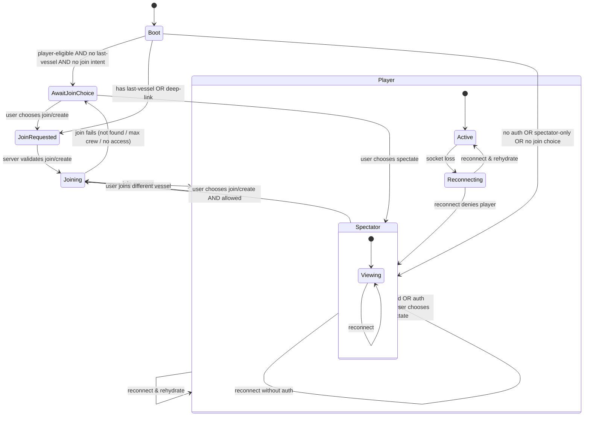

# System rethink

## Entry & First Load

1. New user, no vessel, player‑eligible → show join/create choice; do not auto‑spawn. <!-- Also do not create ship object at this stage. -->
2. New user, no vessel, spectator‑only → force spectator, hide join/create. <!-- do not create a ship object at this stage. Only show ship model for other vessels. -->
3. Returning user, last vessel exists and active → auto‑join last vessel. <!-- what does active mean in this context? -> vessel exists, status active, not stored auctioned, repossessed. Belongs to user, is joinable. -->
4. Returning user, last vessel stored/auctioned → show join/create choice.
5. User deep‑links to /sim?vesselId=... → verify access; join if allowed; otherwise error + fallback.
6. User navigates back/forward from /sim → ensure rehydrate or safe fallback if state is stale.

## Vessel Assignment & Ownership

1. User tries to join a vessel they own → join succeeds, crew assigned.
2. User tries to join a vessel they do not own → allow if role/admin or shared/joinable.
3. User is already assigned to vessel A and joins vessel B → detach from A, persist, then join B. <!-- this should only be allowed if ruleset permits. For casual should be allowed to detach from A anywhere, and join B anywhere. For sim / hardcore, only allow in ports or if other vessel is nearby. Enforced server-side, gate UI on client. -->
4. User joins a vessel that is AI and uncrewed → AI transitions to player.
5. User joins a vessel that is at max crew → reject and explain.
6. Vessel is stored/auctioned/repossessed while player is onboard → force disembark to join/create.
7. Vessel ownership changes (sale/charter/lease) while player is onboard → decide whether to retain control or eject. <!-- If the player is not the owner, they should remain onboard. In effect from the buyer's perspective, the vessel is sold with the crew, and the crew is free to detach (any time in casual, at port or near another vessel in sim mode) -->
8. Vessel is deleted while player is onboard → fall back to join/create.

## Session Lifecycle (Browser)

1. Refresh page while in player mode → rehydrate to same vessel, preserve position.
2. Tab switch (visibility change) → do not demote to spectator; no forced reset.
3. Browser crash → on next load, user should rejoin last vessel.
4. Idle tab for long time → should remain player unless explicit timeout policy.
5. Multiple tabs open in same account → define whether they can both be player or one should become spectator. <!-- one should become player, and rest should be spectator. Implement single-writer model. Tab lease or active tab heartbeat to avoid conflicts. -->
6. Same user logged in from multiple devices → define “active player” lease across devices. <!-- We should disconnect from other devices, and retain the session on the latest one. Same applies with multiple tabs opened. Keep a short TTL. Notify other sessions that they were demoted. -->
7. Token refresh/rotation mid-session → socket auth should update seamlessly.

## Network/Server Events

1. Client loses websocket but page stays open → reconnect should retain role + vessel.
2. Server restarts → client reconnects, restores last vessel and role.
3. Server crashes mid‑update → client should rehydrate cleanly on reconnect.
4. Client reconnects without auth token → join choice or spectator fallback (guest behavior).
5. Socket connect/disconnect storm (flapping) → avoid mode thrash.
6. High latency / packet reordering → ignore stale simulation updates.
7. Partial updates stop for a while → client should request resync or accept full state.

## Auth & Permissions

1. Auth expires mid‑session → client loses player privileges; demote to spectator with notice.
2. Role changes mid‑session (admin toggled) → update UI + permissions without reload.
3. Rank gating (space requires higher rank) → deny player join with clear reason.
4. User is muted/banned mid‑session → disconnect or downgrade privileges with notice.

## Vessel State Persistence

1. Player leaves vessel → vessel should persist last position/heading.
2. Last crew leaves vessel → AI takes over based on desired policy.
3. AI vessel persists movement over time (or not) → define explicitly. <!-- AI should currently come to a halt safely. If detected to be on a shipping lane, pull aside. Latter should be considered future enhancement. -->
4. Client sends stale position after reconnect → server should ignore or reconcile.
5. Client sends updates after being demoted to spectator → server should ignore.

## Joining / Creating

1. Join with vesselId that doesn’t exist → error + show join list.
2. Create new vessel while already in another → detach from old, then create. <!-- only if ruleset allows. We can also define that new vessels will be created in an assigned port or dock, and player must (fast)travel there, to get on the vessel. -->
3. Join with incorrect spaceId → reject or auto‑switch space.
4. Deep-link to a vessel in a different space while already connected → switch space or reject with a clear error.

## Edge‑Case Concurrency

1. Two clients try to join last available vessel simultaneously → resolve deterministically.
2. One client claims helm/engine, another claims at same time → server arbitration.
3. User disconnects while holding helm → release station immediately or after timeout.
4. Two tabs of same user try to claim helm/engine simultaneously → server chooses one.

## Observability & Debuggability

1. Client should log mode changes + vesselId changes with source (server vs local).
2. Server should log join/leave events with userId + vesselId + reason.

